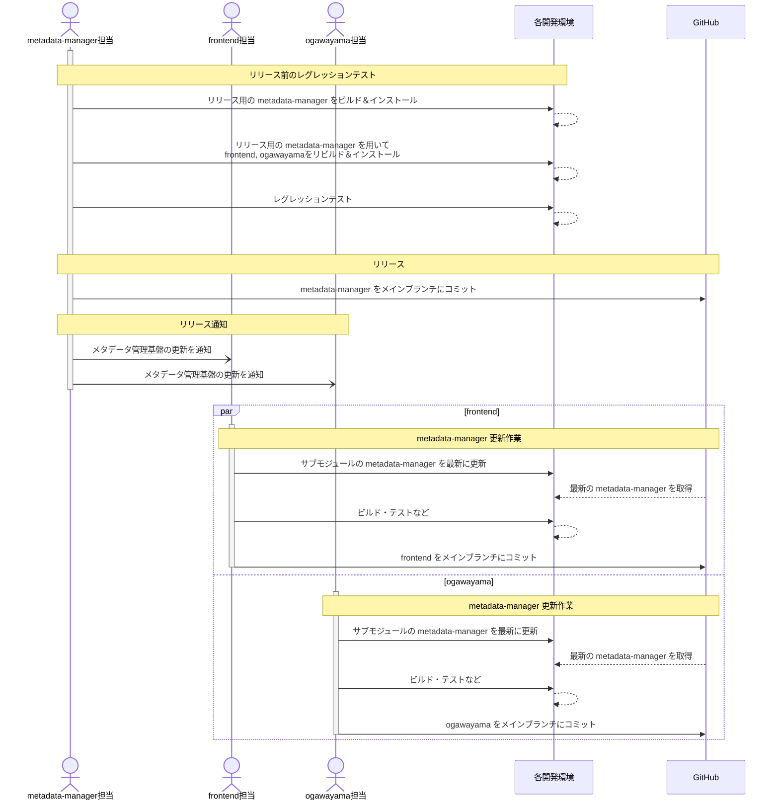

【Project-Tsurugi Internal User Only】

# metadata-managerリリース手順 （検討資料）

2023.07.13 KCC

---

## 目次

- [metadata-managerリリース手順 （検討資料）](#metadata-managerリリース手順-検討資料)
  - [目次](#目次)
  - [1 はじめに](#1-はじめに)
    - [1.1 本書の目的](#11-本書の目的)
    - [1.2 前提条件](#12-前提条件)
  - [2 リリースの流れ](#2-リリースの流れ)
  - [3 リリース前手順](#3-リリース前手順)
    - [3.1 ビルド](#31-ビルド)
      - [3.1.1 metadata-manager](#311-metadata-manager)
      - [3.1.2 frontend](#312-frontend)
      - [3.1.3 ogawayama](#313-ogawayama)
    - [3.2 レグレッションテスト](#32-レグレッションテスト)
  - [4 リリース手順](#4-リリース手順)
    - [4.1 リリース](#41-リリース)
    - [4.2 リリース通知](#42-リリース通知)
  - [5 その他](#5-その他)
    - [5.1 タグ付けルール](#51-タグ付けルール)
    - [5.2 リリース通知](#52-リリース通知)

---

## 1 はじめに

### 1.1 本書の目的

本書は、Tsurugiのメタデータを管理する`metadata-manager`（統合メタデータ管理基盤）をリリース（メインブランチにコミット）する手順を示す。

### 1.2 前提条件

ビルドやレグレッションテスト、リリース等の各種手順は、各コンポーネントに準ずる。

## 2 リリースの流れ

`metadata-manager`をメインブランチにリリースする際の作業の流れを示す。



## 3 リリース前手順

### 3.1 ビルド

#### 3.1.1 metadata-manager

1. READMEの `How to build` に従い、リリース予定のmetadata-managerをリビルドおよびインストールする。

#### 3.1.2 frontend

1. frontendのREADMEに従い、frontendの取得およびサブモジュールの取得を行う。  
   > **－ 参考 －**  
   > README: `How to build frontend` > `1. Install required packages.` ~ `3. Clone frontend.`
2. サブモジュールのmetadata-manager (`third_party/metadata-manager`) をリリースするmetadata-managerに入れ替える。
3. frontendのREADMEに従い、frontendをリビルドおよびインストールする。  
   > **－ 参考 －**  
   > README: `How to build frontend` > `4. Build and Install tsurugi.` ~

#### 3.1.3 ogawayama

1. ogawayamaのREADMEに従い、ogawayamaの取得およびサブモジュールの取得を行う。
   > **－ 参考 －**  
   > README: `How to build`
2. サブモジュールのmetadata-manager (`third_party/metadata-manager`) をリリースするmetadata-managerに入れ替える。  
   ※入れ替え手順は [`3.1.2 frontend`](#312-frontend) > `frontendのビルド環境がある場合`を参照。
3. ogawayamaのREADMEに従い、ogawayamaをリビルドおよびインストールする。  
   > **－ 参考 －**  
   > README: `How to build`

### 3.2 レグレッションテスト

1. frontendのREADMEに従い、レグレッションテストを実施する。  
   > **－ 参考 －**  
   > README: `Regression tests`

## 4 リリース手順

### 4.1 リリース

1. metadata-managerのリリース対象ブランチをリモートリポジトリのメインブランチにマージする。
2. マージコミットのコミットIDを確認する。  
   ※確認したコミットIDは、リリース通知で使用する。
3. リモートリポジトリにタグ付けをする。  
   ※詳細は［[5.1 タグ付けルール](#51-タグ付けルール)］を参照。

### 4.2 リリース通知

1. metadata-managerのリリース通知を各コンポーネント担当に通知する。  
   ※詳細は［[5.2 リリース通知](#52-リリース通知)］を参照。

> **課題**  
> frontend担当、ogawayama担当のアクション

## 5 その他

### 5.1 タグ付けルール

タグ名は以下の命名規則に則って付与する。

> **課題**  
> タグ名の命名規則を検討する  
> `release-`＋バージョン番号（e.g., `release-1.0`）

<!-- > `release-`＋バージョン番号（e.g. `release-1.0`） -->

また、タグ付けの際のコメントについては、任意とする。

### 5.2 リリース通知

リリースの通知は、metadata-managerリポジトリのリリース通知用のissueにて行う。  

> **課題**  
> issueは1つでリリース毎にコメント追加か、リリース毎にissueを新規に作成するか。

リリース通知の内容は、issueコメントに記載する。記載内容は以下のとおり。

> **課題**  
> リリース通知(issueコメント)の内容

  ```text
  リリースバージョン (タグ名と同等)
  コミットID
  ```

  ```text
  release-1.0
  31b474ae8c7889f21baed92b15a4ec5d5e65f46b
  ```

> **課題**  
> frontend担当、ogawayama担当のアクション

<!--
## 4 リリース手順 (`frontend`)

コンポーネントの各種手順およびルールに従い、`metadata-manager`を最新に更新しリリースする。

## 5. リリース手順 (`ogawayama`)

コンポーネントの各種手順およびルールに従い、`metadata-manager`を最新に更新しリリースする。
-->
