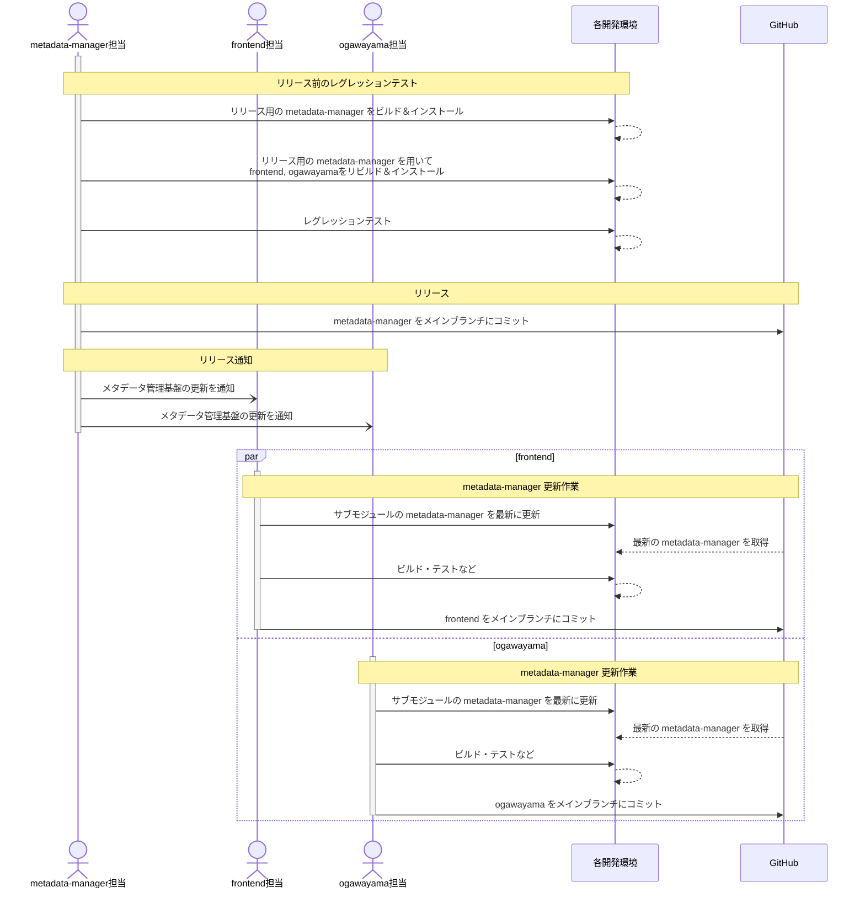

【Project-Tsurugi Internal User Only】

# metadata-managerリリース手順 （検討資料）

2023.07.12 KCC

---

## 目次

- [metadata-managerリリース手順 （検討資料）](#metadata-managerリリース手順-検討資料)
  - [目次](#目次)
  - [1 はじめに](#1-はじめに)
    - [1.1 本書の目的](#11-本書の目的)
    - [1.2 前提条件](#12-前提条件)
  - [2 リリースの流れ](#2-リリースの流れ)
  - [3 リリース前手順](#3-リリース前手順)
    - [3.1 ビルド](#31-ビルド)
      - [3.1.1 metadata-manager](#311-metadata-manager)
      - [3.1.2 frontend](#312-frontend)
      - [3.1.3 ogawayama](#313-ogawayama)
    - [3.2 レグレッションテスト](#32-レグレッションテスト)
  - [4 リリース手順](#4-リリース手順)
    - [4.1 リリース](#41-リリース)
    - [4.2 リリース通知](#42-リリース通知)

---

## 1 はじめに

### 1.1 本書の目的

本書は、Tsurugiのメタデータを管理する`metadata-manager`（統合メタデータ管理基盤）をリリース（メインブランチにコミット）する手順を示す。

### 1.2 前提条件

ビルドやレグレッションテスト、リリース等の各種手順は、各コンポーネントに準ずる。

## 2 リリースの流れ

`metadata-manager`をメインブランチにリリースする際の作業の流れを示す。



## 3 リリース前手順

### 3.1 ビルド

#### 3.1.1 metadata-manager

1. READMEの `How to build` に従い、リリース予定のmetadata-managerをリビルドおよびインストールする。

#### 3.1.2 frontend

> ビルド環境がない場合は、事前にfrontendのREADMEに従い、frontendのビルド環境を構築する。  
> README: `How to build frontend` > `Install required packages.` ~ `Clone frontend.`

1. サブモジュールのmetadata-manager (`third_party/metadata-manager`) をリリースするmetadata-managerに入れ替える。

    ```sh
    cd /path/to/frontend
    rm -rf third_party/metadata-manager

    ## e.g., GitHubの metadata-manager リポジトリのブランチと入れ替える場合
    git clone -b <ブランチ名> git@github.com:project-tsurugi/metadata-manager.git third_party/metadata-manager

    ## e.g., 開発環境の metadata-manager と入れ替える場合
    ln -s /path/to/release/metadata-manager third_party/metadata-manager
    ```

2. frontendをリビルドおよびインストールする。

   ```sh
   cd /path/to/frontend
   make clean && make
   make install
   ```

#### 3.1.3 ogawayama

> ビルド環境がない場合は、事前にogawayamaのREADMEに従い、ogawayamaのビルド環境を構築する。  
> README: `How to build`

1. ogawayamaのREADMEに従い、ogawayamaの取得およびサブモジュールの取得を行う。
2. サブモジュールのmetadata-manager (`third_party/metadata-manager`) をリリースするmetadata-managerに入れ替える。  
   ※入れ替え手順は [`3.1.2 frontend`](#312-frontend) > `frontendのビルド環境がある場合`を参照。
3. ogawayamaのREADMEに従い、ogawayamaをリビルドおよびインストールする。  
   README: `How to build`

### 3.2 レグレッションテスト

1. PostgreSQLを起動する。

   ```sh
   pg_ctl start
   ```

2. レグレッションテストを実行する。

   ```sh
   cd /path/to/frontend
   make tests
   ```

   `$HOME/.local/bin`以外にoltpがインストールされている場合、`oltp`コマンドが存在しない旨のエラーが表示される。  

   ```shell-session
   test.sh: line 7: /home/postgres/.local/bin/oltp: No such file or directory
   test.sh: line 8: /home/postgres/.local/bin/oltp: No such file or directory
   ```

   この場合、手動でoltpを起動した後にレグレッションテストを実行する必要がある。

   ```sh
   oltp start
   make installcheck
   ```

## 4 リリース手順

### 4.1 リリース

1. metadata-managerのリリース対象ブランチをリモートリポジトリのメインブランチにマージする。
2. リモートリポジトリにタグ付けをする。  
   ※タグ名の命名規則およびコメント内容については別途検討

### 4.2 リリース通知

1. metadata-managerのリリース通知を各コンポーネント担当に通知する。  
   ※通知方法等は別途検討

<!--
## 4 リリース手順 (`frontend`)

コンポーネントの各種手順およびルールに従い、`metadata-manager`を最新に更新しリリースする。

## 5. リリース手順 (`ogawayama`)

コンポーネントの各種手順およびルールに従い、`metadata-manager`を最新に更新しリリースする。
-->
