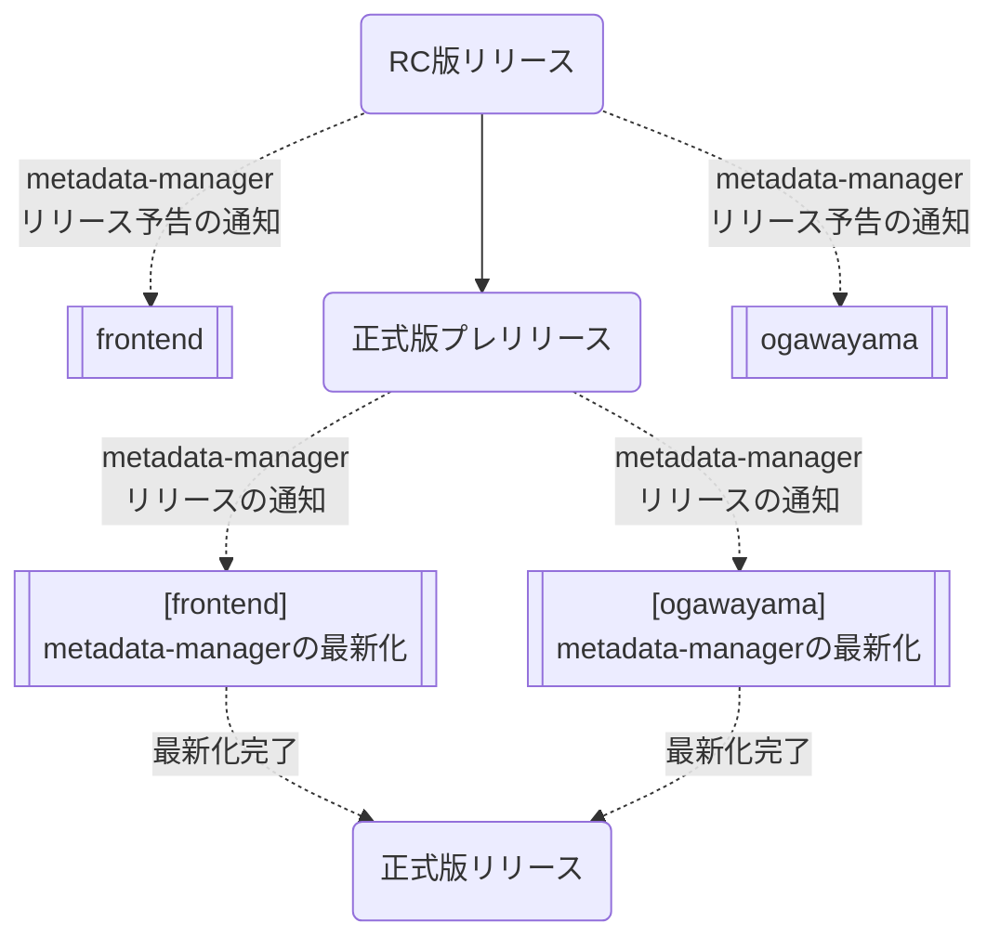
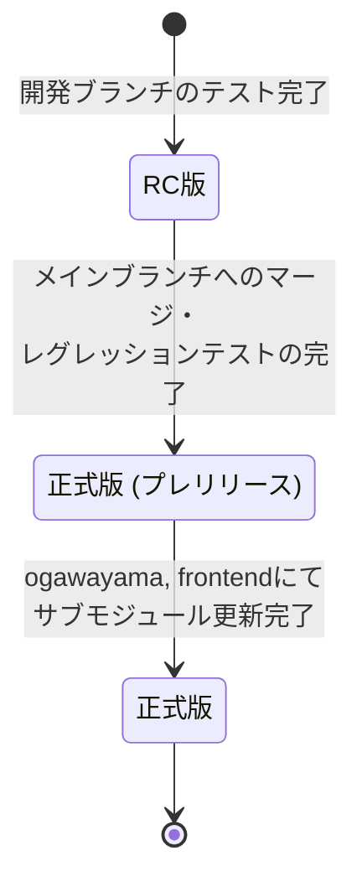
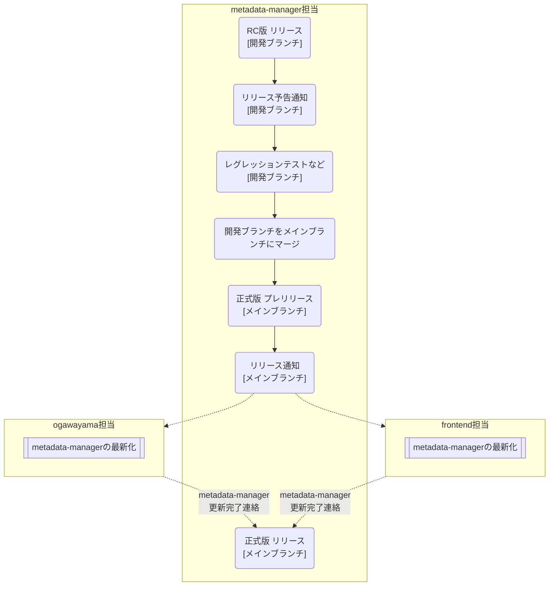
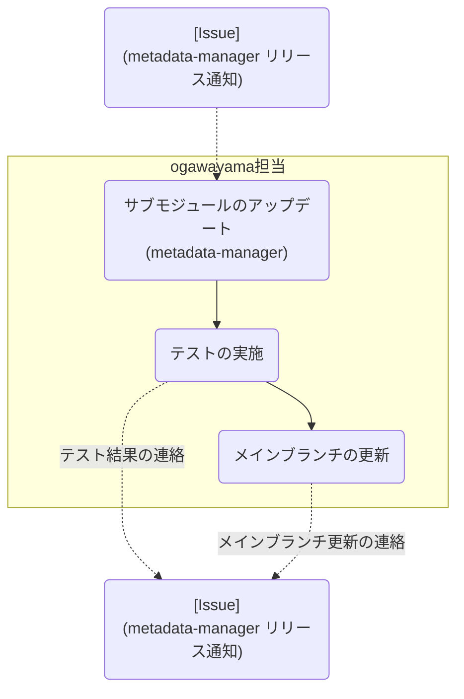
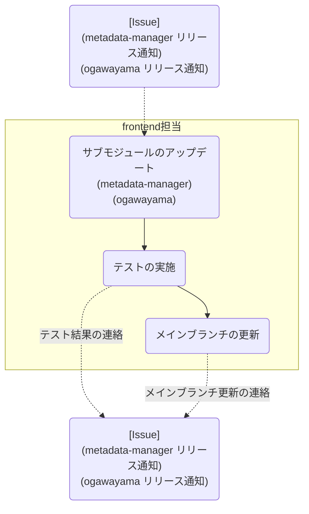

【Project-Tsurugi Internal User Only】

# metadata-managerリリース手順

2023.07.20 KCC

---

## 目次

- [metadata-managerリリース手順](#metadata-managerリリース手順)
  - [目次](#目次)
  - [1 はじめに](#1-はじめに)
    - [1.1 本書の目的](#11-本書の目的)
    - [1.2 前提条件](#12-前提条件)
  - [2 リリースの流れ](#2-リリースの流れ)
    - [リリース](#リリース)
      - [RC版 (Release Candidate)](#rc版-release-candidate)
      - [プレリリース版](#プレリリース版)
      - [正式版](#正式版)
  - [3 担当毎の作業](#3-担当毎の作業)
    - [metadata-manager担当](#metadata-manager担当)
    - [ogawayama担当](#ogawayama担当)
    - [frontend担当](#frontend担当)

---

## 1 はじめに

### 1.1 本書の目的

本書は、Tsurugiのメタデータを管理する`metadata-manager`（統合メタデータ管理基盤）をリリース（メインブランチにコミット）する手順を示す。

### 1.2 前提条件

ビルドやレグレッションテスト、リリース等の各種手順は、各コンポーネントに準ずる。

## 2 リリースの流れ

`metadata-manager`をメインブランチにリリースする際の作業の流れを示す。

### リリース

リリースの管理は、GitHubのリリースを用いて実現する。  
リリースは、開発ブランチのリリースであるRC版 (Release Candidate)と、メインブランチの正式リリースとなる正式版に大別される。  
また、正式版はプレリリースと正式リリースに分かれ、ogawayamaおよびfrontendにおけるサブモジュール(metadata-manager)の更新状況によって遷移する。

#### RC版 (Release Candidate)

- 開発ブランチの一過性のリリースバージョン。
- 通常は使用されないが、大規模開発やインタフェース変更など、必要に応じて正式リリース前に他コンポーネントで使用する事を目的としたバージョンとなる。

#### プレリリース版

- 開発ブランチをマージしたメインブランチのプレリリースバージョン。
- ogawayamaおよびfrontendにおけるサブモジュール更新およびテストを行うためのリリースバージョンとなる。
- 正式版と差分がない最新状態ではあるが、GitHub上にて`pre-release`としてマークされたバージョンとなる。

#### 正式版

- メインブランチの正式公開の最新リリースバージョン。
- ogawayamaおよびfrontendにおけるサブモジュール更新が完了し、コンポーネント間の同期がとれたバージョンとなる。
- GitHub上にて`Latest`としてマークされたバージョンとなり、プレリリース版との違いはリリース状態のみ。

## 3 担当毎の作業

### metadata-manager担当

1. metadata-managerの開発ブランチにコミットする。
2. GitHubにてRC版のリリースを作成する。
   - **`GitHub` > `Releases`**
     - `Choose a tag`: リリースバージョン (e.g., `v1.0.0-rc.1`)
     - `Target`: 開発ブランチ (e.g., `new-feature`)
     - `Release title`: リリースバージョン (e.g., `v1.0.0-rc.1`)
     - `Describe this`: リリース内容 (e.g., 変更内容など)
     - `Set as a pre-release`
3. リリース通知用のIssueを作成する。
   - **リリース予告** (メインブランチ (`master`) 更新の事前告知)
     - リリースURL (e.g., `https://github.com/project-xxxxxx/metadata-manager/releases/tag/v1.0.0-rc.1`)
     - リリース内容 (GitHubリリースの `Describe this` と同等の内容)
     - 特記事項など (e.g., 影響の有無や範囲など)
4. メインブランチへのマージ前作業 (レグレッションテストなど)
5. 開発ブランチをメインブランチにマージする。
6. GitHubにて正式版リリースを作成する。
   - **`GitHub` > `Releases`**
     - `Choose a tag`: リリースバージョン (e.g., `v1.0.0`)
     - `Target`: メインブランチ (e.g., `master`)
     - `Release title`: リリースバージョン (e.g., `v1.0.0`)
     - `Describe this`: リリース内容 (e.g., 変更内容など)
     - `Set as a pre-release`
7. リリース通知用のIssueにコメントを追加する。
   - **リリース通知** (メインブランチ (`master`) 更新の連絡)
     - リリースURL (e.g., `https://github.com/project-xxxxxx/metadata-manager/releases/tag/v1.0.0`)
     - リリース内容 (GitHubリリースの `Describe this` と同等の内容)
     - 特記事項など (e.g., 影響の有無や範囲など)
8. ogawayamaおよびfrontend担当より更新完了の連絡待ち。
9. [6]にて作成したリリースを`Latest release`に変更する。
   - **`GitHub` > `Releases`**
     - `Set as the latest release`

### ogawayama担当

1. metadata-managerのメインブランチの更新を確認する。
2. ogawayamaのサブモジュールをアップデートする。
   - metadata-manager
3. レグレッションテストを実施する。
4. リリース通知用のIssueにコメントを追加する。
   - テスト結果
5. ogawayamaのメインブランチにサブモジュールの更新をコミットする。
6. リリース通知用のIssueにコメントを追加する。
   - メインブランチの更新

### frontend担当

1. metadata-managerおよびogawayamaのメインブランチの更新を確認する。
2. frontendのサブモジュールをアップデートする。
   - metadata-manager
   - ogawayama
3. レグレッションテストを実施する。
4. リリース通知用のIssueにコメントを追加する。
   - テスト結果
5. frontendのメインブランチにサブモジュールの更新をコミットする。
6. リリース通知用のIssueにコメントを追加する。
   - メインブランチの更新
