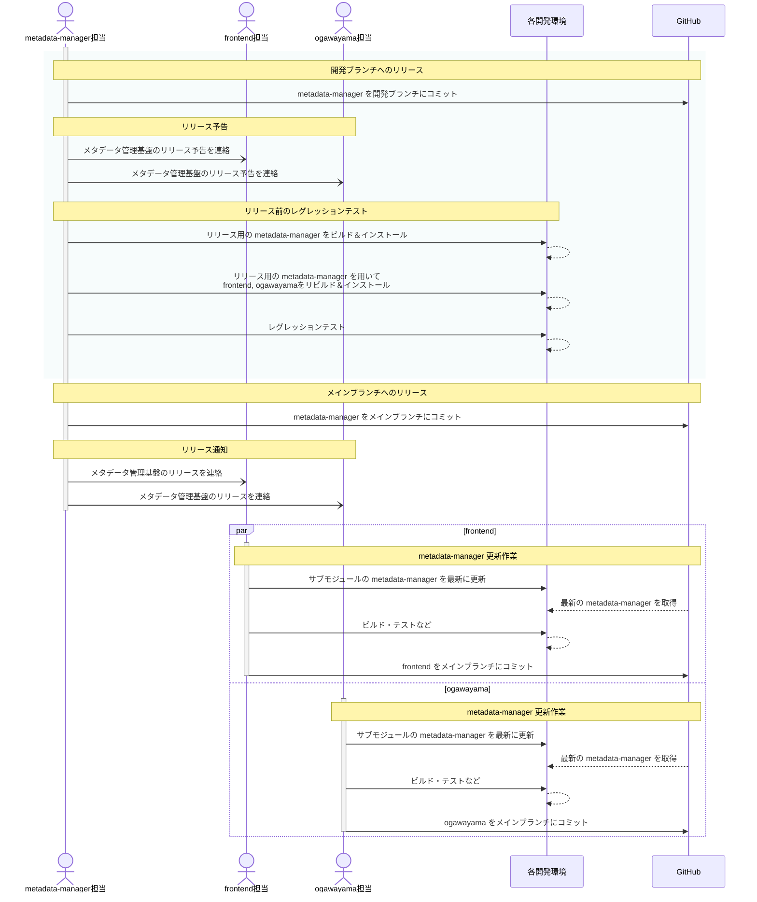

【Project-Tsurugi Internal User Only】

# metadata-managerリリース手順

2023.07.18 KCC

---

## 目次

- [metadata-managerリリース手順](#metadata-managerリリース手順)
  - [目次](#目次)
  - [1 はじめに](#1-はじめに)
    - [1.1 本書の目的](#11-本書の目的)
    - [1.2 前提条件](#12-前提条件)
  - [2 リリースの流れ](#2-リリースの流れ)
  - [3 リリース前手順](#3-リリース前手順)
    - [3.1 リリース予告の通知](#31-リリース予告の通知)
    - [3.1 ビルド](#31-ビルド)
      - [3.1.1 metadata-manager](#311-metadata-manager)
      - [3.1.2 frontend](#312-frontend)
      - [3.1.3 ogawayama](#313-ogawayama)
    - [3.2 レグレッションテスト](#32-レグレッションテスト)
  - [4 リリース手順](#4-リリース手順)
    - [4.1 リリース](#41-リリース)
    - [4.2 リリースの通知](#42-リリースの通知)
  - [5 その他](#5-その他)
    - [5.1 タグ付けルール](#51-タグ付けルール)
    - [5.2 リリース予告](#52-リリース予告)
    - [5.3 リリース通知](#53-リリース通知)

---

## 1 はじめに

### 1.1 本書の目的

本書は、Tsurugiのメタデータを管理する`metadata-manager`（統合メタデータ管理基盤）をリリース（メインブランチにコミット）する手順を示す。

### 1.2 前提条件

ビルドやレグレッションテスト、リリース等の各種手順は、各コンポーネントに準ずる。

## 2 リリースの流れ

`metadata-manager`をメインブランチにリリースする際の作業の流れを示す。

## 3 リリース前手順

### 3.1 リリース予告の通知

1. metadata-managerのリリース予告通知を各コンポーネント担当に通知する。  
   ※詳細は［[5.2 リリース予告](#52-リリース予告)］を参照。

### 3.1 ビルド

#### 3.1.1 metadata-manager

1. READMEの `How to build` に従い、リリース予定のmetadata-managerをリビルドおよびインストールする。

#### 3.1.2 frontend

1. frontendのREADMEに従い、frontendの取得およびサブモジュールの取得を行う。  
   > **－ 参考 －**  
   > README: `How to build frontend` > `1. Install required packages.` ~ `3. Clone frontend.`
2. サブモジュールのmetadata-manager (`third_party/metadata-manager`) をリリースするmetadata-managerに入れ替える。
3. frontendのREADMEに従い、frontendをリビルドおよびインストールする。  
   > **－ 参考 －**  
   > README: `How to build frontend` > `4. Build and Install tsurugi.` ~

#### 3.1.3 ogawayama

1. ogawayamaのREADMEに従い、ogawayamaの取得およびサブモジュールの取得を行う。
   > **－ 参考 －**  
   > README: `How to build`
2. サブモジュールのmetadata-manager (`third_party/metadata-manager`) をリリースするmetadata-managerに入れ替える。  
   ※入れ替え手順は [`3.1.2 frontend`](#312-frontend) > `frontendのビルド環境がある場合`を参照。
3. ogawayamaのREADMEに従い、ogawayamaをリビルドおよびインストールする。  
   > **－ 参考 －**  
   > README: `How to build`

### 3.2 レグレッションテスト

1. frontendのREADMEに従い、レグレッションテストを実施する。  
   > **－ 参考 －**  
   > README: `Regression tests`

## 4 リリース手順

### 4.1 リリース

1. metadata-managerの開発ブランチをメインブランチにマージする。
2. マージコミットのコミットIDを確認する。  
   ※確認したコミットIDは、リリース通知で使用する。
3. リモートリポジトリにタグ付けをする。  
   ※詳細は［[5.1 タグ付けルール](#51-タグ付けルール)］を参照。

### 4.2 リリースの通知

1. metadata-managerのリリース通知を各コンポーネント担当に連絡する。  
   ※詳細は［[5.3 リリース通知](#53-リリース通知)］を参照。
2. 各コンポーネントにて、metadata-managerの更新、テスト、リリースなどを実施し、リリース通知のissueコメント等にて連絡する。

## 5 その他

### 5.1 タグ付けルール

タグ名は以下の命名規則に則って付与する。

> **課題**  
> タグ名の命名規則を検討する  
> `v`＋バージョン番号（e.g., `v1.0.0`）

また、タグ付けの際のコメントについては、任意とする。

### 5.2 リリース予告

リリース予告は、リリース毎にmetadata-managerリポジトリのissueを新規に作成し、下記の内容を記載する。  

- ブランチ名
- リリースバージョン (タグ名と同等)
- コミットID
- 特記事項など (e.g. 影響の有無や範囲など)

### 5.3 リリース通知

リリース通知は、リリース毎にmetadata-managerリポジトリのissueを新規に作成し、下記の内容を記載する。  

- リリース予告のissue
- リリースバージョン (タグ名と同等)
- コミットID
