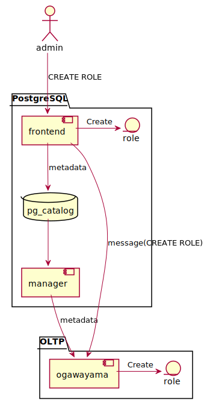
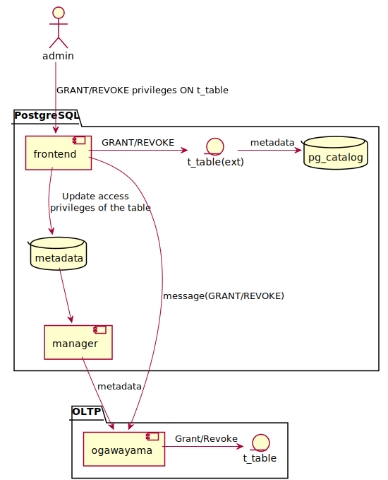
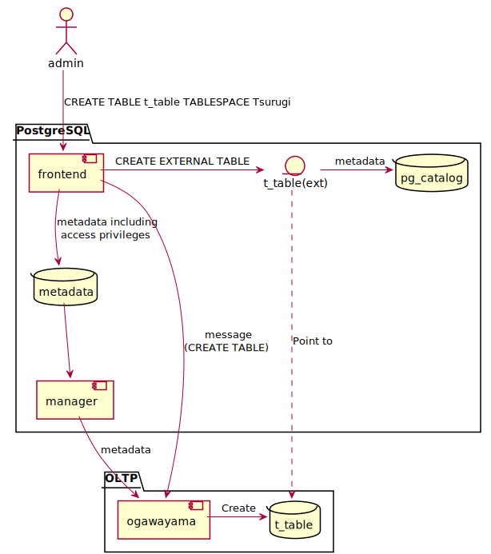
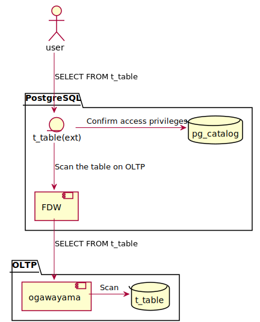
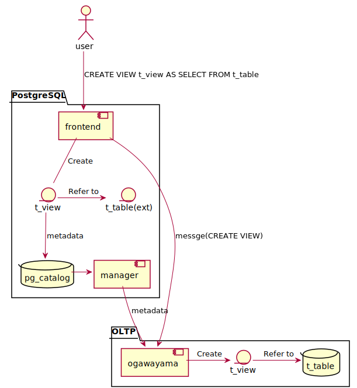
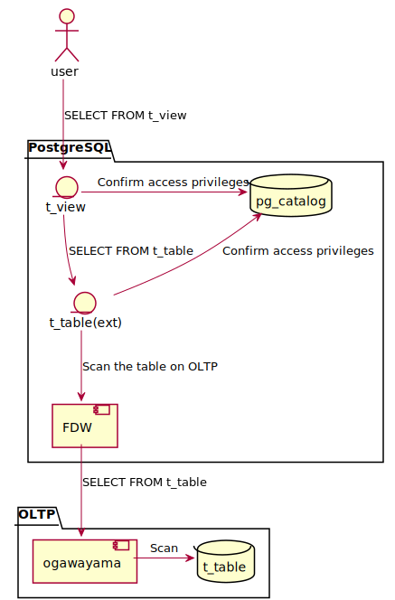
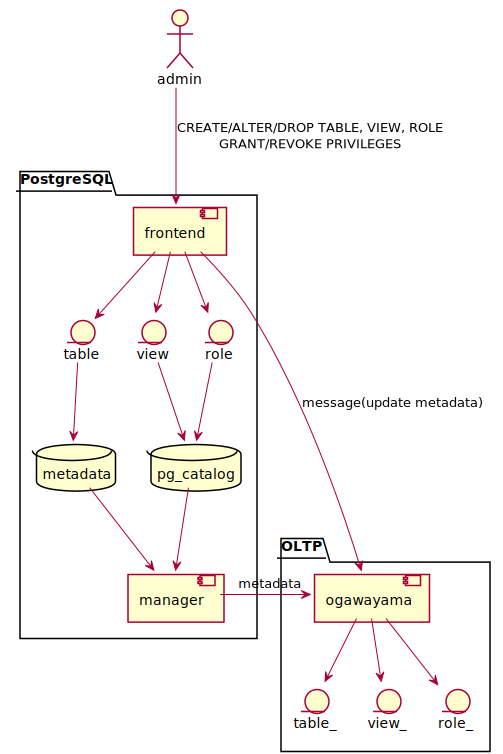

【Project-Tsurugi Internal Use Only】

# Tsurugi ユーザ管理機能 基本設計書

2021.07.30 NEC

<!-- TOC -->

- [Tsurugi ユーザ管理機能 基本設計書](#tsurugi-%E3%83%A6%E3%83%BC%E3%82%B6%E7%AE%A1%E7%90%86%E6%A9%9F%E8%83%BD-%E5%9F%BA%E6%9C%AC%E8%A8%AD%E8%A8%88%E6%9B%B8)
  - [機能](#%E6%A9%9F%E8%83%BD)
  - [付与可能な権限](#%E4%BB%98%E4%B8%8E%E5%8F%AF%E8%83%BD%E3%81%AA%E6%A8%A9%E9%99%90)
  - [基本的な実現方法](#%E5%9F%BA%E6%9C%AC%E7%9A%84%E3%81%AA%E5%AE%9F%E7%8F%BE%E6%96%B9%E6%B3%95)
    - [ロール制御機能](#%E3%83%AD%E3%83%BC%E3%83%AB%E5%88%B6%E5%BE%A1%E6%A9%9F%E8%83%BD)
    - [アクセス権限制御機能](#%E3%82%A2%E3%82%AF%E3%82%BB%E3%82%B9%E6%A8%A9%E9%99%90%E5%88%B6%E5%BE%A1%E6%A9%9F%E8%83%BD)
      - [GRANT/REVOKE](#grantrevoke)
      - [テーブル](#%E3%83%86%E3%83%BC%E3%83%96%E3%83%AB)
      - [ビュー](#%E3%83%93%E3%83%A5%E3%83%BC)
      - [メタデータ管理](#%E3%83%A1%E3%82%BF%E3%83%87%E3%83%BC%E3%82%BF%E7%AE%A1%E7%90%86)
    - [認証機能](#%E8%AA%8D%E8%A8%BC%E6%A9%9F%E8%83%BD)
      - [認証](#%E8%AA%8D%E8%A8%BC)

<!-- /TOC -->

## 機能

1. ロール制御機能

    | # | 機能名 | 説明 | コマンド名 | 備考 |
    |---|---|---|---|---|
    |1. | ロール作成機能      | ロールを作成する。       | CREATE ROLE | - |
    |2. | ロール削除機能      | ロールを削除する。       | DROP ROLE   | - |
    |3. | ロール属性変更機能  | ロールの属性を変更する。 | ALTER ROLE  | - |

1. アクセス権限制御機能

    | # | 機能名 | 説明 | コマンド名 | 備考 |
    |---|---|---|---|---|
    |1. | アクセス権限付与機能  | 権限を付与する。  | GRANT  | - |
    |2. | アクセス権限取消機能  | 権限を削除する。  | REVOKE | - |

    - 対象データベースオブジェクト：ロール, OLTPテーブル, ビュー, ~~プロシージャ~~

1. 認証・認可機能

    - 認証機能
      - ユーザ認証

    - 認可機能
      - データベースオブジェクトアクセス権限
        - 対象データベースオブジェクト：

## 付与可能な権限

まずはPostgreSQLの仕様に準ずる方針とする。

- PostgreSQL 12.4文書
  - <https://www.postgresql.jp/document/12/html/ddl-priv.html#PRIVILEGE-ABBREVS-TABLE>

## 基本的な実現方法

PostgreSQL(frontend/FDW)と統合メタデータ管理基盤(manager)、OLTPの関係は以下のとおりである。

### 1. ロール制御機能

- ROLEの作成

  - 管理者からの要求により、PostgreSQL上でロールを作成し、PostgreSQLのシステムカタログにメタデータが登録される
  - PostgreSQL上で作成されたロールのメタデータは統合メタデータ管理基盤経由でOLTPに提供される

  

### 2. アクセス権限制御機能

#### GRANT/REVOKE

- 管理者からの要求により、PostgreSQL上のデータベースオブジェクト（外部テーブル／ビュー等）に対してアクセス権限を付与したり、取り消したりする。
- アクセス権限情報は各データベースオブジェクトのメタデータに含むこととする

#### テーブル

- OLTPテーブルの作成
  - OLTP上にOLTPテーブルを作成する
  - 利用者からの要求により、PostgreSQL上にOLTPテーブルを指す外部テーブルを作成する
  - 利用者に直接外部テーブル（CREATE EXTERNAL TABLE）を作成させない理由  
    →外部テーブルではプライマリキーの指定をすることができないため、要求はCREATE TABLE文で受け付ける。

  

- OLTPテーブルの参照
  1. 利用者は外部テーブルに対してSELECT文を発行する
  1. PostgreSQLは外部テーブルのアクセス権限を確認する
  1. FDWを経由して実際のOLTPテーブルのデータを参照する

  

#### ビュー

- OLTPテーブルを参照するビューの作成
  - 利用者からの要求により、PostgreSQL上に外部テーブル（OLTPテーブル）を参照するビューを作成する

  

- ビューの参照
  - ビューの参照先の外部テーブルからFDWを介してOLTPテーブルのデータを参照する

  

- アクセス権限を設定したビューの参照

#### メタデータ管理

- 各データベースオブジェクトのアクセス権限情報を含むメタデータは、PostgreSQLのシステムカタログや統合メタデータ管理基盤に格納される
- 統合メタデータ管理基盤はOLTPなどのクライアントに対して各データベースオブジェクトのメタデータを提供する

### 3. 認証機能

#### 認証

- ユーザ認証
  - OLTPからのコマンド実行要求に対して、PostgreSQLのメタデータでユーザ認証を行う

  

以上
