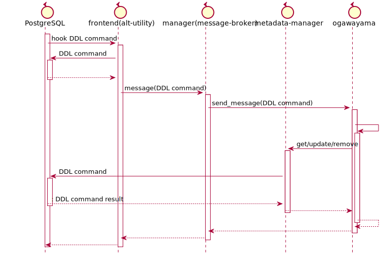

# ユーザ管理機能 外部、内部設計

2021.09.02 NEC

- 今回開発するバージョンは、V4.0とします。

## 目次

<!-- @import "[TOC]" {cmd="toc" depthFrom=1 depthTo=6 orderedList=false} -->

<!-- code_chunk_output -->

- [ユーザ管理機能 外部、内部設計](#ユーザ管理機能-外部内部設計)
  - [目次](#目次)
  - [目的](#目的)
  - [全体のシーケンス概要](#全体のシーケンス概要)
  - [方針](#方針)
    - [全体の方針](#全体の方針)
    - [テーブルの概要](#テーブルの概要)
    - [ロールの概要](#ロールの概要)
  - [外部設計](#外部設計)
    - [テーブルメタデータオブジェクト(Tables)](#テーブルメタデータオブジェクトtables)
      - [テーブルメタデータオブジェクト例（JSON形式でのイメージ）](#テーブルメタデータオブジェクト例json形式でのイメージ)
      - [アクセス権のフォーマット構文](#アクセス権のフォーマット構文)
    - [ロールメタデータオブジェクト(Roles)](#ロールメタデータオブジェクトroles)
      - [ロールデータオブジェクト例（JSON形式でのイメージ）](#ロールデータオブジェクト例json形式でのイメージ)
      - [ロールデータオブジェクト例（PostgreSQL形式でのイメージ）](#ロールデータオブジェクト例postgresql形式でのイメージ)
    - [メソッド(Metadata Manager)](#メソッドmetadata-manager)
      - [Rolesクラスメソッド(新規追加)](#rolesクラスメソッド新規追加)
        - [Rolesコンストラクタ](#rolesコンストラクタ)
        - [Roles::init](#rolesinit)
        - [Roles::get](#rolesget)
        - [Roles::remove](#rolesremove)
      - [Tablesクラスメソッド](#tablesクラスメソッド)
      - [Tables::confirm_permission_in_acls(新規追加)](#tablesconfirm_permission_in_acls新規追加)
    - [メソッド(Message Broker)](#メソッドmessage-broker)
      - [enum MessageIdクラス(追加)](#enum-messageidクラス追加)
      - [派生Messageクラス(追加)](#派生messageクラス追加)
  - [内部設計](#内部設計)
    - [DBテーブル](#dbテーブル)
      - [テーブルメタデータテーブル](#テーブルメタデータテーブル)
  - [メソッド(Frontend)](#メソッドfrontend)
    - [tsurugi_ProcessUtility](#tsurugi_processutility)
  - [参考](#参考)
    - [PostgreSQL内のデータ構造の例](#postgresql内のデータ構造の例)
      - [pg_authidの構造](#pg_authidの構造)
      - [pg_auth_membersの構造](#pg_auth_membersの構造)
      - [pg_classの構造](#pg_classの構造)

<!-- /code_chunk_output -->

## 目的

ROLE/VIEWをサポートするため、以下の機能をもつDDLをサポートする。

| #   | 機能名                  | 説明                       | DDL          | 備考 |
| --- | ----------------------- | -------------------------- | ------------ | ---- |
| 1   | ROLEを作成              | ロール定義を作成する       | CREATE ROLE  | -    |
| 2   | ROLEを削除              | ロール定義を削除する       | DROP ROLE    | -    |
| 3   | ROLEを変更              | ロール定義の属性を変更する | ALTER ROLE   | -    |
| 4.  | TABLEのアクセス権限付与 | アクセス権限を付与する。   | GRANT TABLE  | -    |
| 5.  | TABLEのアクセス権限取消 | アクセス権限を削除する。   | REVOKE TABLE | -    |
| 6.  | ROLEの親ROLE付与        | 親ROLEを付与する。         | GRANT ROLE   | -    |
| 7.  | ROLEの親ROLE削除        | 親ROLEを削除する。         | REVOKE ROLE  | -    |

## 全体のシーケンス概要

全体のシーケンスにDDL用の処理を示す。



## 方針

### 全体の方針

ROLEについては、DDL構文の解析、実行は、標準のPostgreSQLの機能(standard_ProcessUtility)を使用する。
その前後に処理を追加して、メッセージ送信などの処理を追加する。

※ 更新、削除に関する動作は、変更になる可能性があります。
   具体的には、DROP/ALTER/GRANT/REVOKEで変更・削除を行った際にメッセージ送信に失敗した時に行った変更を修正する動作をしない方針で記載しています。
   今後、これらの方針が決まったあとで、仕様書を修正、または、改造仕様書を作成します。

データの格納先は、PostgreSQLのみとする。JSONは現状未サポート。

### テーブルの概要

既存のテーブルのメタデータに、テーブルオーナーIDとアクセス権の項目を追加する。

- テーブルオーナIDをメタデータマネージャが追加はCREATE TABLE時とする。

- アクセス権の追加は以下の方法。
  - GRANT/REVOKE DDLコマンド時に外部テーブルaclにaddメソッドを使用して格納する。

### ロールの概要

PostgreSQLの標準で備わっているROLEの機能を使用する。
DDLで作成、変更、削除を実施して、getメソッドでメタデータを取得する。
CREATEでメッセージ送信失敗時のためにremoveメソッドを実装する。

- メタデータで実装するメソッド
  - addメソッド(※)
  - getメソッド
  - removeメソッド
 ※ 実装はするが、何もしない。

## 外部設計

### テーブルメタデータオブジェクト(Tables)

Metadata Managerによって取得できるデータの内容を以下に示す。

今回の改造でacl,tableownerの追加以外変更しない。(太字以外の追加なし)
記載の項目が古い場合は、最新のものを正とする。

| #       | キー名            | データ型    | 説明                                   | 採番  | add   | 備考          |
| ------- | ----------------- | ----------- | -------------------------------------- | ----- | ----- | ------------- |
| 1.      | format_version*   | int32_t     | オブジェクトのフォーマットバージョン。 | ○     | -     | -             |
| 2.      | generation*       | int64_t     | メタデータの世代。                     | ○     | -     | 現状"1"固定。 |
| 3.      | id*               | int64_t     | テーブルオブジェクトのOID。            | ○     | -     | -             |
| 4.      | name*             | string      | テーブル名。                           | -     | ○     | -             |
| 5.      | namespace         | string      | 名前空間名（スキーマ名）。             | -     | -     | -             |
| 6.      | primary_keys      | json        | プライマリキーのカラム番号。           | -     | -     | 複数指定可。  |
| 7.      | tuples            | float       | テーブルの推定行数。                   | -     | -     | -             |
| 8.      | columns           | Node        | 列メタデータオブジェクト群 。          | -     | ○     | -             |
| **9.**  | **owner_role_id** | **int64_t** | **テーブルオーナーのロールのOID。**    | **o** | **x** | **新規追加**  |
| **10.** | **acl**           | **json**    | **アクセス権限**                       | **o** | **x** | **新規追加**  |

- *はすべてのメタデータオブジェクトに含まれるパラメータであることを示す。
- "採番"の項目は統合メタデータ管理基盤で自動採番される。
- "add"はaddメソッド実行時に入力が必須の項目。
  - xのものはRead Onlyの項目です。

- デフォルト値
  - owner_role_id
    - Tableを作成したロールのOIDです。
  - acl
    - pg_default_aclの値をとります。pg_default_aclがない場合は、NULLになります。
    - NULLの場合は、作成したロール(または、スーパーユーザ)のみがフルアクセス権を持ちます。
- aclフォーマット
  - フォーマットについては、[アクセス権のフォーマット構文](#アクセス権のフォーマット構文)を確認してください。

#### テーブルメタデータオブジェクト例（JSON形式でのイメージ）

- 例1) すべての項目を設定した場合
  - addメソッド実行時

    ```json
    {
      "name": "PUBLIC.foo", 
      "namespace": "PUBLIC", 
      "primary_keys": [1,2], 
      "tuples": 231000, 
      "columns": [
        {...}, 
        {...}, 
        {...}
      ],
    }
    ```

  - getメソッド実行時

    ```json
    {
      "format_version": 1, 
      "generation": 1, 
      "id": 3, 
      "name": "PUBLIC.foo", 
      "namespace": "PUBLIC", 
      "primary_keys": [1,2], 
      "tuples": 231000, 
      "columns": [
        {...}, 
        {...}, 
        {...}
      ],
      "owner_role_id":10,
      "acl":[
        "admin=arwdDxt/admin",
        "test1=r/admin",
        "test2=ar/admin"
      ]
    }
    ```

- 例2) 最低限の項目を設定した場合
  - addメソッド実行時

    ```json
    {
      "name": "PUBLIC.foo", 
      "columns": []
    }
    ```

  - getメソッド実行時

    ```json
    {
      "format_version": 1, 
      "generation": 1, 
      "id": 3, 
      "name": "PUBLIC.foo", 
      "namespace": "", 
      "primary_keys": [], 
      "tuples": 0, 
      "columns": [
      ],
      "owner_role_id":10,
      "acl":[
      ]
    }
    ```

#### アクセス権のフォーマット構文

```text
<AclFormat>: 
        [<RoleName>]=<AclList>/<AdderRoleName>

<RoleName>=<AclList> -- ロールに与えられた権限
=<AclList>           -- PUBLICに与えられた権限(左辺を省略した場合)
<AclList>            -- アクセス権限
/<AdderRoleName>     -- この権限を付与したロール

<AclList>:  
        r -- SELECT（読み取り（read））
        w -- UPDATE（書き込み（write））
        a -- INSERT（追加（append））
        d -- DELETE
        D -- TRUNCATE
        x -- REFERENCES
        t -- TRIGGER
        X -- EXECUTE
        U -- USAGE
        C -- CREATE
        c -- CONNECT
        T -- TEMPORARY
  arwdDxt -- すべての権限 (テーブル用。他のオブジェクトでは異なります。)
        * -- 直前の権限に関するグラントオプション
```

(例)

```sql
select oid,relname,relacl from pg_class where oid=16398;

  oid  |  relname  |                     relacl
-------+-----------+-------------------------------------------------
 16398 | test1     | {admin=arwdDxt/admin,test1=r/admin}
(1 row)
```

### ロールメタデータオブジェクト(Roles)

Metadata Managerによって取得できるデータの内容を以下に示す。
データについては、今後使用する可能性を考えて、pg_authidの要素をすべて渡す。
DDL構文のみで追加、更新、削除をするため、addによる追加はサポートしない。

| #   | キー名         | データ型 | 説明                                                                                  | 備考 |
| --- | -------------- | -------- | ------------------------------------------------------------------------------------- | ---- |
| 1   | oid            | int64_t  | ロールの識別子                                                                        |
| 2   | rolname        | string   | ロール名                                                                              |
| 3   | rolsuper       | bool     | スーパーユーザの権限を持っています                                                    |
| 4   | rolinherit     | bool     | 自動的にメンバとして属するロールの権限を継承します                                    |
| 5   | rolcreaterole  | bool     | ロールを作成することができます                                                        |
| 6   | rolcreatedb    | bool     | データベースを作成することができます                                                  |
| 7   | rolcanlogin    | bool     | ロールはログインすることができます。                                                  |
| 8   | rolreplication | bool     | ロールはレプリケーション用のロールです。                                              |
| 9   | rolbypassrls   | bool     | すべての行単位セキュリティポリシーを無視するロール。                                  |
| 10  | rolconnlimit   | int32_t  | ロールが確立できる同時実行接続数。 -1は制限無しを意味します。                         |
| 11  | rolpassword    | string   | パスワード。無い場合はNULLです。 書式は使用される暗号化の形式に依存します。           |
| 12  | rolvaliduntil  | string   | パスワード有効期限（パスワード認証でのみ使用）。 NULLの場合には満了時間はありません。 |

- 懸念事項
  - パスワードについては、設定でどのようにとれるか、確認しながら進める必要がある。
    - 暗号化されていない場合は、取得しないほうが良いと考える。
  - timestamptzについては、Text型に変換して受け取る場合のフォーマットをどうするか。

#### ロールデータオブジェクト例（JSON形式でのイメージ）

- 例1) すべての項目を設定した場合
  - getメソッド実行時

    ```json
    {
      "oid": 16391, 
      "rolname": "test1", 
      "rolsuper": false, 
      "rolinherit": true, 
      "rolcreaterole": false, 
      "rolcreatedb": false, 
      "rolcanlogin": false, 
      "rolreplication": false,
      "rolbypassrls":false,
      "rolconnlimit": -1,
      "rolpassword":"",
      "rolvaliduntil":""
    }
    ```

#### ロールデータオブジェクト例（PostgreSQL形式でのイメージ）

```sql
select * from pg_authid where oid=16391;

  oid  | rolname | rolsuper | rolinherit | rolcreaterole | rolcreatedb | rolcanlogin | rolreplication | rolbypassrls | rolconnlimit | rolpassword | rolvaliduntil
-------+---------+----------+------------+---------------+-------------+-------------+----------------+--------------+--------------+----------------------------
 16391 | test1   | f        | t          | f             | f           | f           | f              | f            |           -1 |             |
(1 row)
```

### メソッド(Metadata Manager)

#### Rolesクラスメソッド(新規追加)

##### Rolesコンストラクタ

- 書式
  `Roles(std::string_view database, std::string_view component)`

- 概要
  providerを作成する。
  
- 引数
  - [in] std::string_view database
    データベース名。
  - [in] std::string_view component
    コンポネント名。

- 戻り値
  なし

##### Roles::init

- 書式
  `init()`

- 概要
  providerを初期化する。
  
- 引数
  なし

- 戻り値
  なし

##### Roles::get

- 書式
  `get(const ObjectIdType object_id,boost::property_tree::ptree& object)`
  `get(std::string_view object_name, boost::property_tree::ptree& object)`

- 概要
  指定されたオブジェクトIDまたはオブジェクト名を持つロール(PostgreSQL上のpg_authid)のメタデータをコンテナに格納して返す。
  
- 引数
  - [in] ObjectIdType object_id
    ロールオブジェクトのOID。
  - [in] std::string_view object_name
    ロールオブジェクトの名前。
  - [out] boost::property_tree::ptree& object
    ロールメタデータオブジェクトを格納したコンテナ。

- 戻り値
  - ErrorCode::OK
    成功。

  - ErrorCode::OK以外
    失敗。

##### Roles::remove

- 書式
  `remove(const ObjectIdType object_id)`
  `remove(const char* object_name, ObjectIdType* object_id)`

- 概要
  指定されたオブジェクトIDまたはオブジェクト名を持つロール(PostgreSQL上のpg_authid)のメタデータを削除する。
  オブジェクト名を指定したとき、削除したロールのオブジェクトIDを返す。
  
- 引数
  - [in] ObjectIdType object_id
    ロールオブジェクトのOID。
  - [in] char* object_name
    ロールオブジェクトの名前。
  - [out] ObjectIdType* object_id
    削除したロールメタデータのオブジェクトID。

- 戻り値
  - ErrorCode::OK
    成功。

  - ErrorCode::OK以外
    失敗。

#### Tablesクラスメソッド

既存のメソッドについては、Metadata Mangerとやり取りする[テーブルメタデータオブジェクト(Tables)](#テーブルメタデータオブジェクト(Tables))以外の変更はありません。

#### Tables::confirm_permission_in_acls(新規追加)

- 書式
  `confirm_permission_in_acls(const ObjectIdType object_id, const char permission, bool& result)`
  `confirm_permission_in_acls(const std::string_view object_name, const char permission, bool& result)`

- 概要
  指定したロールのオブジェクトID、または、ロールのオブジェクト名が、指定したアクセス権をTablesのアクセス権に含まれているかの結果を返す。
  確認のとき、継承フラグがTRUEのときは、指定したロールの親ロールを再帰的に確認する。

- 引数
  - [in] ObjectIdType object_id
    ロールオブジェクトのOID。
  - [in] std::string_view object_name
    ロールオブジェクトの名前。
  - [in] char permission
    アクセス権を確認したい文字。
    フォーマットに指定できる文字は、詳しくは、[アクセス権のフォーマット構文](#アクセス権のフォーマット構文)を確認してください。
  - [out] bool& result
    アクセス権を持つかどうか。

- 戻り値
  - ErrorCode::OK
    成功。

  - ErrorCode::OK以外
    失敗。

### メソッド(Message Broker)

追加、改造部分のみを記載する。他の個所については、変更なし。

#### enum MessageIdクラス(追加)

- 対象ヘッダファイル
  manager/message-broker/include/manager/message/message.h

- 概要
  以下の太字の各メッセージのIDを追加する。

  - メッセージID一覧
      | メッセージID     | ユーザーが入力した構文 |
      | ---------------- | ---------------------- |
      | CREATE_TABLE     | CREATE TABLE構文       |
      | **CREATE_ROLE**  | **CREATE ROLE構文**    |
      | **DROP_ROLE**    | **DROP ROLE構文**      |
      | **ALTER_ROLE**   | **ALTER ROLE構文**     |
      | **GRANT_TABLE**  | **GRANT TABLE構文**    |
      | **REVOKE_TABLE** | **REVOKE TABLE構文**   |
      | **GRANT_ROLE**   | **GRANT ROLE構文**     |
      | **REVOKE_ROLE**  | **REVOKE ROLE構文**    |
      | **CREATE_VIEW**  | **CREATE VIEW構文**    |
      | **DROP_VIEW**    | **DROP VIEW構文**      |

(参考)

Messageクラス

- 概要
  メッセージの内容、メッセージの受信者である派生Receiverリストを保持する。

- Messageフィールド

| フィールド名      | 説明                                                                                         |
| ----------------- | -------------------------------------------------------------------------------------------- |
| id                | メッセージID。ユーザーが入力した構文に応じて、すべての派生Receiverにその構文を伝えるためID。 |
| object_id         | 追加・更新・削除される対象のオブジェクトID 例）テーブルメタデータのオブジェクトID            |
| receivers         | メッセージの受信者である派生Receiverリスト。例）OltpReceiver、OlapReceiver                   |
| message_type_name | エラーメッセージ出力用の文字列　例）"CREATE TABLE"                                           |

- id
  - 型:列挙型(enum class)
    - 規定型:int
    - 次の通り管理する。
      - リポジトリ名：manager/message-broker
      - 名前空間：manager::message

#### 派生Messageクラス(追加)

- 対象ヘッダファイル
  manager/message-broker/include/manager/message/message.h
- 書式
  `XxxxYyyyMessage(uint64_t object_id)`

- 概要
  以下太字のクラスを作成し、対応するメッセージのIDを追加するコンストラクタを作成する。
  
| クラス名               | ユーザーが入力した構文 |
| ---------------------- | ---------------------- |
| CreateTableMessage     | CREATE TABLE構文       |
| **CreateRoleMessage**  | **CREATE ROLE構文**    |
| **DropRoleMessage**    | **DROP ROLE構文**      |
| **AlterRoleMessage**   | **ALTER ROLE構文**     |
| **GrantTableMessage**  | **GRANT TABLE構文**    |
| **RevokeTableMessage** | **REVOKE TABLE構文**   |
| **GrantRoleMessage**   | **GRANT ROLE構文**     |
| **RevokeRoleMessage**  | **REVOKE ROLE構文**    |
| **CreateViewMessage**  | **CREATE VIEW構文**    |
| **DropViewMessage**    | **DROP VIEW構文**      |

## 内部設計

### DBテーブル

#### テーブルメタデータテーブル

テーブル統計情報はTableメタデータテーブルに格納する。  

テーブル名：tsurugi_class

（変更点）

| #   | 名前           | 型        | 主キー | 参照先       | NOT NULL | 説明                                                 |
| --- | -------------- | --------- | ------ | ------------ | -------- | ---------------------------------------------------- |
| 1.  | format_version | integer   | -      | -            | ○        | フォーマットバージョン。                             |
| 2.  | generation     | bigint    | -      | -            | ○        | メタデータの世代。                                   |
| 3.  | id             | bigserial | ○      | -            | ○        | テーブルのOID。                                      |
| 4.  | name           | text      | -      | -            | ○        | テーブル名。                                         |
| 5.  | namespace      | text      | -      | -            | -        | 名前空間名（スキーマ名）。                           |
| 6.  | primary_key    | json      | -      | -            | -        | プライマリキーのカラム番号。bigintの配列を想定する。 |
| 7.  | reltuples      | real      | -      | -            | -        | テーブルの推定行数。                                 |
| 8.  | owner_role_id  | bigint    | -      | 外部テーブル | ○        | テーブルオーナーのロールのOID。                      |
| 9.  | acl            | aclitem[] | -      | 外部テーブル | -        | アクセス権。                                         |

- owner_role_idは外部テーブルのオーナーIDをJOINします。
- aclは外部テーブルのアクセス権をJOINします。

## メソッド(Frontend)

### tsurugi_ProcessUtility

- 書式
  書式については、変更なし。

  ```cpp
  void tsurugi_ProcessUtility(PlannedStmt *pstmt,
                     const char *queryString, ProcessUtilityContext context,
                     ParamListInfo params,
                     QueryEnvironment *queryEnv,
                     DestReceiver *dest, char *completionTag)
  ```

- 概要
  ProcessUtility_hook関数。
  上記に以下のNode TAG毎に動作を分けてそれぞれ記載する。

  | #   | DDL          | Node TAG         | 処理概要                                                                                                                                        |
  | --- | ------------ | ---------------- | ----------------------------------------------------------------------------------------------------------------------------------------------- |
  | 1.  | CREATE ROLE  | T_CreateRoleStmt | standard_ProcessUtilityを呼び出し作成。作成したロールIDを含むメッセージを送信する。                                                             |
  | 2.  | DROP ROLE    | T_DropRoleStmt   | 削除前に削除するロールの情報を取得する。standard_ProcessUtilityを呼び出し削除。削除したロールIDを含むメッセージを送信する。                     |
  | 3.  | ALTER ROLE   | T_AlterRoleStmt  | 変更前に変更するロールの情報を取得する。standard_ProcessUtilityを呼び出し変更。変更したロールIDを含むメッセージを送信する。                     |
  | 4.  | GRANT TABLE  | T_GrantStmt      | 外部テーブルのテーブルオブジェクトを変更する。変更したテーブルIDを含むメッセージを送信する。                                                    |
  | 5.  | REVOKE TABLE | T_GrantStmt      | 外部テーブルのテーブルオブジェクトを変更する。変更したテーブルIDを含むメッセージを送信する。                                                    |
  | 6.  | GRANT ROLE   | T_GrantRoleStmt  | standard_ProcessUtilityを呼び出しメンバーを追加。追加したメンバーのロールIDを含むメッセージを送信する。                                         |
  | 7.  | REVOKE ROLE  | T_GrantRoleStmt  | 変更前に変更するメンバーのロールの情報を取得する。standard_ProcessUtilityを呼び出し変更。変更したメンバーのロールIDを含むメッセージを送信する。 |

  - ロール,は通常のstandard_ProcessUtilityを呼び出しを行い、前後の処理を追加し処理のチェック、および、メッセージを送付する処理を追加する。

  - GRANT/REVOKEについては、NodeTAGに違いがないため、is_grantで判断する必要がありそう。

(参考) <https://github.com/taminomara/psql-hooks/blob/master/Detailed.md#ProcessUtility_hook>

---

## 参考

### PostgreSQL内のデータ構造の例

#### pg_authidの構造

PostgreSQL12上でのROLEの格納データを示す。

```sql
select * from pg_authid where oid=16391;

  oid  | rolname | rolsuper | rolinherit | rolcreaterole | rolcreatedb | rolcan
login | rolreplication | rolbypassrls | rolconnlimit | rolpassword | rolvalidun
til
-------+---------+----------+------------+---------------+-------------+-------
------+----------------+--------------+--------------+-------------+-----------
----
 16391 | test1   | f        | t          | f             | f           | f
      | f              | f            |           -1 |             |
(1 row)
```

#### pg_auth_membersの構造

PostgreSQL12上でのROLEのメンバーの格納データを示す。

```sql
select * from pg_auth_members where member=16391;

 roleid | member | grantor | admin_option
--------+--------+---------+--------------
  16387 |  16391 |      10 | f
  16390 |  16391 |      10 | f
(2 rows)
```

#### pg_classの構造

PostgreSQL12上でのTABLE/VIEWのアクセス権の格納データを示す。

```sql
select * from pg_class where oid=16392;
  oid  | relname | relnamespace | reltype | reloftype | relowner | relam | relf
ilenode | reltablespace | relpages | reltuples | relallvisible | reltoastrelid
| relhasindex | relisshared | relpersistence | relkind | relnatts | relchecks |
 relhasrules | relhastriggers | relhassubclass | relrowsecurity | relforcerowse
curity | relispopulated | relreplident | relispartition | relrewrite | relfroze
nxid | relminmxid |                     relacl                      | reloption
s | relpartbound
-------+---------+--------------+---------+-----------+----------+-------+-----
--------+---------------+----------+-----------+---------------+---------------
+-------------+-------------+----------------+---------+----------+-----------+
-------------+----------------+----------------+----------------+--------------
-------+----------------+--------------+----------------+------------+---------
-----+------------+-------------------------------------------------+----------
--+--------------
 16392 | test1   |         2200 |   16394 |         0 |       10 |     2 |
  16392 |             0 |        0 |         0 |             0 |             0
| f           | f           | p              | r       |        2 |         0 |
 f           | f              | f              | f              | f
       | t              | d            | f              |          0 |
 497 |          1 | {admin=arwdDxt/admin,test1=r/admin} |
  |
(1 row)
```

```sql
select oid,relname,relacl from pg_class where oid=16398;
  oid  |  relname  |                     relacl
-------+-----------+-------------------------------------------------
 16398 | test1     | {admin=arwdDxt/admin,test1=r/admin}
(1 row)
```
