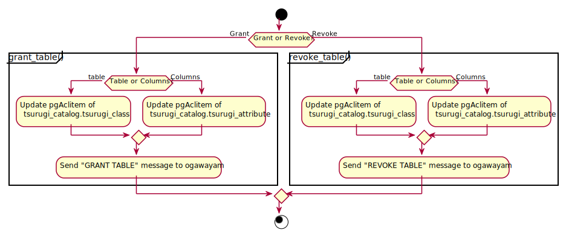
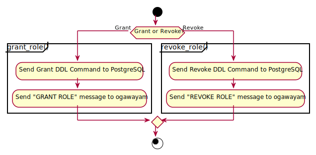

# ユーザ管理機能 GRANT/REVOKE権機能設計

2021.08.04 NEC

- 今回開発するバージョンは、V4.0とします。

## 目次

<!-- @import "[TOC]" {cmd="toc" depthFrom=1 depthTo=6 orderedList=false} -->

<!-- code_chunk_output -->

- [ユーザ管理機能 GRANT/REVOKE権機能設計](#ユーザ管理機能-grantrevoke権機能設計)
  - [目次](#目次)
  - [目的](#目的)
  - [基本方針](#基本方針)
  - [サポート対象コマンド](#サポート対象コマンド)
  - [全体のシーケンス概要](#全体のシーケンス概要)
  - [サポートする構文](#サポートする構文)
    - [サポートするGRANT DDL構文](#サポートするgrant-ddl構文)
    - [サポートするREVOKE DDL構文](#サポートするrevoke-ddl構文)
    - [アクセス権のフォーマット](#アクセス権のフォーマット)
  - [改造・追加内容](#改造追加内容)
    - [PostgreSQLのデータ変更箇所](#postgresqlのデータ変更箇所)
      - [追加するTABLEのメタデータ](#追加するtableのメタデータ)
    - [frontend](#frontend)
      - [alt_utility変更概要](#alt_utility変更概要)
        - [alt_utilityインターフェース](#alt_utilityインターフェース)
    - [manager](#manager)
      - [message-broker変更概要](#message-broker変更概要)
        - [send_messageメソッド](#send_messageメソッド)
        - [Message](#message)
          - [Message説明](#message説明)
          - [Messageフィールド](#messageフィールド)
        - [set_receiverメソッド](#set_receiverメソッド)
          - [派生Receiverクラス一覧](#派生receiverクラス一覧)
        - [Receiver](#receiver)
          - [Receiver説明](#receiver説明)
          - [receive_messageメソッド](#receive_messageメソッド)
      - [metadata-manager](#metadata-manager)
        - [Tableオブジェクトの取得データ](#tableオブジェクトの取得データ)
        - [ROLEオブジェクトの取得データ](#roleオブジェクトの取得データ)
      - [参考](#参考)
        - [Status](#status)
          - [説明](#説明)
          - [フィールド](#フィールド)

<!-- /code_chunk_output -->

## 目的

- ユーザ管理のため、ロール、OLTPテーブル、ビューにアクセス権の追加とGRANT/REVOKEに追加する。

## 基本方針

- ここでは、ユーザ管理機能のTABLEにROLEの追加とGRANT/REVOKEに追加のみ記載する。
- DDL構文・型・概念スキーマは、既存のv3.0やPostgreSQLから変更はしない。
- PostgreSQL12を基準とする。

## サポート対象コマンド

以下のアクセス権限制御機能を実装する。

| #   | 機能名               | 説明             | コマンド名 | 備考 |
| --- | -------------------- | ---------------- | ---------- | ---- |
| 1.  | アクセス権限付与機能 | 権限を付与する。 | GRANT      | -    |
| 2.  | アクセス権限取消機能 | 権限を削除する。 | REVOKE     | -    |

- 対象データベースオブジェクト：ロール, OLTPテーブル, ビュー, ~~プロシージャ~~

## 全体のシーケンス概要

全体のシーケンスにDDL用の処理を追加する。


## サポートする構文

### サポートするGRANT DDL構文

以下の構文をサポートする。

ただし、以下の権限については、構文に記載されていますが今回のサポート対象外(※)とする。
※ 動作の保障はしないが、動作する可能性はある。

- REFERENCES
- TRIGGER

また、以下についても今回はサポート対象外とする。

- SCHEMAのアクセス権ついて、サポート対象外とする。
  - SCHEAMのサポート後にサポートを検討する。
- カラムのアクセス権については、サポート対象外とする。
  - 使用要件として上がった場合にサポートを検討する。

(1) テーブルにアクセス権限を付与する。

```sql
GRANT { { SELECT | INSERT | UPDATE | DELETE | TRUNCATE | REFERENCES | TRIGGER }
    [, ...] | ALL [ PRIVILEGES ] }
    ON { [ TABLE ] table_name [, ...]
         | ALL TABLES IN SCHEMA schema_name [, ...] }
    TO role_specification [, ...] [ WITH GRANT OPTION ]
```

(2) ロールに継承するロールを付与する。

```sql
GRANT role_name [, ...] TO role_specification [, ...]
    [ WITH ADMIN OPTION ]
    [ GRANTED BY role_specification ]
```

(参考)

```sql
ここでrole_specificationは以下の通りです。
    [ GROUP ] role_name
  | PUBLIC
  | CURRENT_USER
  | SESSION_USER
```

<https://www.postgresql.jp/document/12/html/sql-grant.html>

### サポートするREVOKE DDL構文

以下の構文をサポートする。

ただし、以下の権限については、今回のサポート対象外(※)とする。
※ 動作の保障はしないが、動作する可能性はある。

- REFERENCES
- TRIGGER

また、以下についても今回はサポート対象外とする。

- SCHEMAのアクセス権ついて、サポート対象外とする。
  - SCHEAMのサポート後にサポートを検討する。
- カラムのアクセス権については、サポート対象外とする。
  - 使用要件として上がった場合にサポートを検討する。

(1) テーブルのアクセス権限を削除する。

```sql
REVOKE [ GRANT OPTION FOR ]
    { { SELECT | INSERT | UPDATE | DELETE | TRUNCATE | REFERENCES | TRIGGER }
    [, ...] | ALL [ PRIVILEGES ] }
    ON { [ TABLE ] table_name [, ...]
         | ALL TABLES IN SCHEMA schema_name [, ...] }
    FROM role_specification [, ...]
    [ CASCADE | RESTRICT ]
```

(2) ロールから継承しているロールを削除する。

```sql
REVOKE [ ADMIN OPTION FOR ]
    role_name [, ...] FROM role_specification [, ...]
    [ GRANTED BY role_specification ]
    [ CASCADE | RESTRICT ]
```

(参考)

```sql
ここでrole_specificationは以下の通りです。
    [ GROUP ] role_name
  | PUBLIC
  | CURRENT_USER
  | SESSION_USER
```

<https://www.postgresql.jp/document/12/html/sql-revoke.html>

### アクセス権のフォーマット

PostgreSQLでのアクセス権のフォーマットは以下のようになります。
Metadataでも同じフォーマットを使用します。

PostgreSQLのフォーマットについて。
PostgreSQLでは、アクセス権のフォーマットについては、各アクセス権フォーマットを配列形式で持っている。表示時には、それらを「+」でつないで表示する。

(アクセス権の表示の詳細)

```text
<AclFormat>: 
        [<RoleName>]=<AclList>/<AdderRoleName>[+<AclFormat>]

<RoleName>=<AclList> -- ロールに与えられた権限
=<AclList>           -- PUBLICに与えられた権限(左辺を省略した場合)
<AclList>            -- アクセス権限
/<AdderRoleName>     -- この権限を付与したロール

<AclList>:  
        r -- SELECT（読み取り（read））
        w -- UPDATE（書き込み（write））
        a -- INSERT（追加（append））
        d -- DELETE
        D -- TRUNCATE
        x -- REFERENCES
        t -- TRIGGER
        X -- EXECUTE
        U -- USAGE
        C -- CREATE
        c -- CONNECT
        T -- TEMPORARY
  arwdDxt -- すべての権限 (テーブル用。他のオブジェクトでは異なります。)
        * -- 直前の権限に関するグラントオプション

```

(実際の表示例)

```sql
test=# \dp
                              Access privileges
 Schema | Name  | Type  |  Access privileges  | Column privileges | Policies
--------+-------+-------+---------------------+-------------------+----------
 public | ttest | table | Admin=arwdDxt/Admin+|                   |
        |       |       | User1=r/Admin      +|                   |
        |       |       | User2=ar/Admin      |                   |
```

## 改造・追加内容

### PostgreSQLのデータ変更箇所

#### 追加するTABLEのメタデータ

- アクセス権限の格納するaclをデータベースへ追加する。
  - 上記以外は既存のデータで、変更はしない。
- メタデータとして渡す場合は、文字列型として渡す。
- GRANT/REVOKEの(1)の構文でテーブルのアクセス権限を操作する際に付与する。
- Table生成時のデフォルト値は、PostgreSQLと同じとする。
  - 作成時は、pg_default_aclの値をとります。pg_default_aclがない場合は、NULLになります。
  - ACLがNULLの場合は、通常作成したロール(または、スーパーユーザ)のみがフルアクセス権を持ちます。

tsurugi_catalog.tsurugi_class

| #     | 名前       | 型(PostgreSQL) | 登録時の指定 | 備考                                 |
| ----- | ---------- | -------------- | ------------ | ------------------------------------ |
| 1     | id         | bigserial      | 自動付与     | テーブルID                           |
| 2     | name       | text           | 必須指定     | テーブル名                           |
| 3     | namespace  | text           | 入力可能     | 名前空間（テーブル名を除く）         |
| 4     | primaryKey | json           | 入力可能     | primaryKeyカラムの"ordinal_position" |
| 5     | reltuples  | float4         | 入力可能     |                                      |
| **6** | **acl**    | **aclitem[]**  | **自動付与** | **アクセス権限**                     |

### frontend

#### alt_utility変更概要

以下のメソッドでHook箇所をNode TAG毎に追加する。
Hook後に使用するTable/Viewへアクセス権限の付与・削除(grant_table/revoke_table)・ROLEへのアクセス権限の付与・削除(grant_role/revoke_role)の処理を追加する。

- tsurugi_ProcessUtility
- tsurugi_ProcessUtilitySlow

| #   | DDL          | メッセージ     | Node TAG        | 備考 |
| --- | ------------ | -------------- | --------------- | ---- |
| 1   | GRANT TABLE  | "GRANT TABLE"  | T_GrantStmt     |      |
| 2   | REVOKE TABLE | "REVOKE TABLE" | T_GrantStmt     |      |
| 3   | GRANT ROLE   | "GRANT ROLE"   | T_GrantRoleStmt |      |
| 4   | REVOKE ROLE  | "REVOKE ROLE"  | T_GrantRoleStmt |      |

- 懸念点
  - NodeTAGにREVOKEがないため、is_grantで判断する必要がありそう。
    参考(<https://doxygen.postgresql.org/utility_8c.html>)

##### alt_utilityインターフェース

ユーザ管理用のインタフェースとしてfrontendのalt_utilityに新たに以下を追加する。

- Grant/Revoke Tableアクティビティ図

  - grant_tableメソッド
    - bool grant_table(List *stmts)
      - 戻値
        | 型   | 値                                                                        |
        | ---- | ------------------------------------------------------------------------- |
        | bool | アクセス権限の更新結果を返却する。<br>成功の場合:TRUE、失敗の場合 : FALSE |
      - 引数
        | 型    | 変数  | 値            |
        | ----- | ----- | ------------- |
        | List* | stmts | SQL文のリスト |
  - revoke_tableメソッド
    - bool revoke_table(List *stmts)
      - 戻値
        | 型   | 値                                                                        |
        | ---- | ------------------------------------------------------------------------- |
        | bool | アクセス権限の更新結果を返却する。<br>成功の場合:TRUE、失敗の場合 : FALSE |
      - 引数
        | 型    | 変数  | 値            |
        | ----- | ----- | ------------- |
        | List* | stmts | SQL文のリスト |

- Grant/Revoke Roleアクティビティ図

  - grant_roleメソッド
    - bool grant_role(List *stmts)
      - 処理概要
        - PostgreSQLのロールのアクセス権限を付与する処理を送る。
        - gawayamaへメッセージを送る。
      - 戻値
        | 型   | 値                                                                                    |
        | ---- | ------------------------------------------------------------------------------------- |
        | bool | ロールのアクセス権限を付与の結果を返却する。<br>成功の場合:TRUE、失敗の  場合 : FALSE |
      - 引数
        | 型    | 変数  | 値            |
        | ----- | ----- | ------------- |
        | List* | stmts | SQL文のリスト |
  - revoke_roleメソッド
    - bool revoke_role(List *stmts)
      - 処理概要
        - PostgreSQLのロールのアクセス権限を削除する処理を送る。
        - gawayamaへメッセージを送る。
      - 戻値
        | 型   | 値                                                                                    |
        | ---- | ------------------------------------------------------------------------------------- |
        | bool | ロールのアクセス権限を削除の結果を返却する。<br>成功の場合:TRUE  失敗の  場合 : FALSE |
      - 引数
        | 型    | 変数  | 値            |
        | ----- | ----- | ------------- |
        | List* | stmts | SQL文のリスト |

### manager

#### message-broker変更概要

v3.0から変更有

- メッセージに以下のROLEのDDLのメッセージを追加する。

| #   | DDL          | メッセージ     | 備考 |
| --- | ------------ | -------------- | ---- |
| 1   | GRANT TABLE  | "GRANT TABLE"  |      |
| 2   | REVOKE TABLE | "REVOKE TABLE" |      |
| 3   | GRANT ROLE   | "GRANT ROLE"   |      |
| 4   | REVOKE ROLE  | "REVOKE ROLE"  |      |

##### send_messageメソッド

v3.0からインタフェースの変更なし。

- Status send_message(Message* message)
  - 処理内容：MessageBrokerは、Messageクラスにセットされたすべての派生Receiverに対して、receive_message()メソッドでメッセージを送信する。
  - 条件
    - 事前条件：Messageクラスのすべてのフィールドがセットされている。
    - 事後条件：
      - 派生Receiverが返した概要エラーコードが「FAILURE」である場合、「FAILURE」が返ってきた時点で即座に、Statusクラスのインスタンスを返す。
      - すべての派生Receiverが返した概要エラーコードが「SUCCESS」である場合、Statusクラスのコンストラクタに次の値をセットして返す。
          | フィールド名   | 値           |
          | -------------- | ------------ |
          | error_code     | SUCCESS      |
          | sub_error_code | (int)SUCCESS |
      - 詳細は[Status](#status)を参照。

##### Message

###### Message説明

- メッセージの内容、メッセージの受信者である派生Receiverリストを保持する。

###### Messageフィールド

| フィールド名      | 説明                                                                                         |
| ----------------- | -------------------------------------------------------------------------------------------- |
| id                | メッセージID。ユーザーが入力した構文に応じて、すべての派生Receiverにその構文を伝えるためID。 |
| object_id         | 追加・更新・削除される対象のオブジェクトID 例）テーブルメタデータのオブジェクトID            |
| receivers         | メッセージの受信者である派生Receiverリスト。例）OltpReceiver、OlapReceiver                   |
| message_type_name | エラーメッセージ出力用の文字列　例）"CREATE TABLE"                                           |

- id
  - 型:列挙型(enum class)
    - 規定型:int
    - 次の通り管理する。
      - リポジトリ名：manager/message-broker
      - 名前空間：manager::message
    - メッセージID一覧
      | メッセージID     | ユーザーが入力した構文 |
      | ---------------- | ---------------------- |
      | CREATE_TABLE     | CREATE TABLE構文       |
      | CREATE_ROLE      | CREATE ROLE構文        |
      | DROP_ROLE        | DROP ROLE構文          |
      | ALTER_ROLE       | ALTER ROLE構文         |
      | **GRANT_TABLE**  | **GRANT TABLE構文**    |
      | **REVOKE_TABLE** | **REVOKE TABLE構文**   |
      | **GRANT_ROLE**   | **GRANT ROLE構文**     |
      | **REVOKE_ROLE**  | **REVOKE ROLE構文**    |

##### set_receiverメソッド

v3.0からインタフェースの変更なし。

- void set_receiver(Receiver *receiver_)
  - Messageクラスの派生Receiverリストに、派生Receiverをセットする。

###### 派生Receiverクラス一覧

| クラス名               | ユーザーが入力した構文 |
| ---------------------- | ---------------------- |
| CreateTableMessage     | CREATE TABLE構文       |
| CreateRoleMessage      | CREATE ROLE構文        |
| DropRoleMessage        | DROP ROLE構文          |
| AlterRoleMessage       | ALTER ROLE構文         |
| **GrantTableMessage**  | **GRANT TABLE構文**    |
| **RevokeTableMessage** | **REVOKE TABLE構文**   |
| **GrantRoleMessage**   | **GRANT ROLE構文**     |
| **RevokeRoleMessage**  | **REVOKE ROLE構文**    |

##### Receiver

###### Receiver説明

- メッセージを受信する。
- 抽象クラス。

###### receive_messageメソッド

v3.0からインタフェースの変更なし。

- Status receive_message(Message* message)
  - 抽象メソッド。実際の処理は、派生Receiverが行う。
  - 処理内容：派生Receiverは、Messageクラスのインスタンスを受け取り、message->get_id()を利用してMessageIdを取得する。MessageIdに応じて処理の実行または、実行を指示する。get_object_id()を利用して、追加・更新・削除される対象のオブジェクトIDを取得する。
  - 条件
    - 事前条件：なし
    - 事後条件：
      - 派生Receiverは、MessageIdに対応する処理を実行後、Statusクラスのインスタンスを生成する。このとき、コンストラクタで概要エラーコード・詳細エラーコードをセットする。生成したStatusクラスのインスタンスを返す。
      - 詳細は[Status](#status)を参照。

#### metadata-manager

v3.0からインタフェースの変更なし。

##### Tableオブジェクトの取得データ

メソッドによって取得できるTableデータの内容を以下に示す。

- acl以外については、変更しない。
- ptreeに格納する際にString型または、String型の配列に変換する。
  - 格納している文字列のフォーマットについては[アクセス権のフォーマット構文](#アクセス権のフォーマット構文)を確認してください。

| #     | 名前(Key)  | 型(PostgreSQL) | 型(Metadata)      | 備考                                 |
| ----- | ---------- | -------------- | ----------------- | ------------------------------------ |
| 1     | id         | bigserial      | number            | テーブルID                           |
| 2     | name       | text           | string            | テーブル名                           |
| 3     | namespace  | text           | string            | 名前空間（テーブル名を除く）         |
| 4     | primaryKey | json           | array[object]     | primaryKeyカラムの"ordinal_position" |
| 5     | reltuples  | float4         | float             | 行数                                 |
| **6** | **acl** | **aclitem[]**  | **array[string]** | **アクセス権限**                     |

##### ROLEオブジェクトの取得データ

ROLEの取得オブジェクトについては、「[ユーザ管理機能 ROLE機能設計](./UserManagement_ROLE_FD.md)」を参照してください。
上記の設計からの変更はありません。

#### 参考

以下、v3.0からの変更なし。参考として記載しています。

##### Status

###### 説明

- send_message()およびreceive_message()の戻り値

###### フィールド

- フィールド一覧

| フィールド名   | 説明             | エラーコードを管理するリポジトリ名 | エラーコードを管理する名前空間 |
| -------------- | ---------------- | ---------------------------------- | ------------------------------ |
| error_code     | 概要エラーコード | manager/message-broker             | manager::message               |
| sub_error_code | 詳細エラーコード | 派生Receiverが配置されるリポジトリ | 派生Receiverで管理             |

- 概要エラーコードと詳細エラーコードの対応表

| error_code | sub_error_code                                                                                                                                                          |
| ---------- | ----------------------------------------------------------------------------------------------------------------------------------------------------------------------- |
| SUCCESS    | 派生Receiverで管理される成功したときのエラーコードをint型にキャストした値。 例)(int)ogawayama::stub::ErrorCode::OK                                                      |
| FAILURE    | 派生Receiverで管理される成功以外のエラーコードをint型にキャストした値。 例)(int)ogawayama::stub::ErrorCode::UNKNOWN,(int)ogawayama::stub::ErrorCode::SERVER_FAILUREなど |
