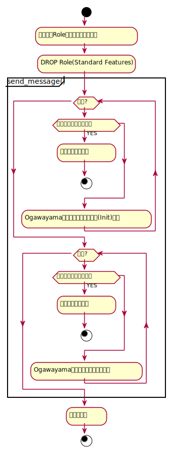

# ユーザ管理機能 DROP ROLEのメッセージ送信失敗時の動作について

2021.08.30 NEC

## 目次

<!-- @import "[TOC]" {cmd="toc" depthFrom=1 depthTo=6 orderedList=false} -->

<!-- code_chunk_output -->

- [ユーザ管理機能 DROP ROLEのメッセージ送信失敗時の動作について](#ユーザ管理機能-drop-roleのメッセージ送信失敗時の動作について)
  - [目次](#目次)
  - [メッセージの作成送信が失敗したときの対処](#メッセージの作成送信が失敗したときの対処)
    - [案1 削除したデータを新たに追加しなおす](#案1-削除したデータを新たに追加しなおす)
      - [案1 アクティビティ図](#案1-アクティビティ図)
      - [案1 懸念点](#案1-懸念点)
    - [案2 DROP前に事前メッセージを送り成功した場合にDROPする](#案2-drop前に事前メッセージを送り成功した場合にdropする)
      - [案2 アクティビティ図](#案2-アクティビティ図)
      - [案2 懸念点](#案2-懸念点)
    - [案3 メッセージを再送する機能を追加する](#案3-メッセージを再送する機能を追加する)
      - [案3 アクティビティ図](#案3-アクティビティ図)
      - [案3 懸念点](#案3-懸念点)
    - [案4 削除したデータはそのままとする](#案4-削除したデータはそのままとする)
      - [案4 アクティビティ図](#案4-アクティビティ図)
      - [案4 懸念点](#案4-懸念点)
    - [案5 DROP前に事前メッセージを送り確認する](#案5-drop前に事前メッセージを送り確認する)
      - [案5 アクティビティ図](#案5-アクティビティ図)
      - [案5 懸念点](#案5-懸念点)
  - [参考](#参考)
    - [参考 Messageフィールド](#参考-messageフィールド)
    - [参考 CREATE TABLEの動作概要](#参考-create-tableの動作概要)
    - [参考 CREATE TABLEの失敗時のソース](#参考-create-tableの失敗時のソース)

<!-- /code_chunk_output -->

## メッセージの作成送信が失敗したときの対処

全体の流れ概要


### 案1 削除したデータを新たに追加しなおす

- メッセージの失敗時にROLEのデータが復元(再作成)する。
- ROLE再作成のためOIDが変更となる仕様を記載する。

#### 案1 アクティビティ図


#### 案1 懸念点

- RoleのOIDが失敗ごとに毎回変更になる。⇒ **ROLE名で管理することで対応可能。**
  - ogawayamaでRoleのOID情報を使用しているとき
    - 取得したOIDが異なるときogawayamaで管理しているOIDを都度変更が必要となる。
    - 更新前にOIDでROLEを取得したとき、Roleデータが見つからないことがある。
- PostgreSQLへ、再度CREATE ROLE、GRANT ROLEの操作が必要となる。
- メッセージ送信先が複数のときの動作の考慮が必要。
  - 例えば、メッセージ送信先が3つあって、2つ成功、1つ失敗など。

### 案2 DROP前に事前メッセージを送り成功した場合にDROPする

- DROP前に事前メッセージを送る。失敗した場合、DROPを行わず終了。

#### 案2 アクティビティ図


#### 案2 懸念点

- メッセージは成功しているが、DROPが失敗したとき整合性が取れなくなる。

### 案3 メッセージを再送する機能を追加する

- メッセージを再送信する機能を作成して、エラーメッセージがあった場合、再送する機能を設計し追加する。
- 現状の動作は、エラーメッセージを残すのみで、PostgreSQLのデータ復旧はしない。

#### 案3 アクティビティ図



#### 案3 懸念点

- 現状、Frontend/managerに再送する機能を有していないため新たに再送機能の設計、作成が必要。

### 案4 削除したデータはそのままとする

- エラーメッセージをのみ残す。
  - PostgreSQLのデータ復旧はしない。
  - メッセージの再送もしない。

#### 案4 アクティビティ図


#### 案4 懸念点

- メッセージ送信先でRoleの情報を保持して使用していたとき整合性が取れなくなる。
  - エラーメッセージを見て手動復旧する必要がある。

### 案5 DROP前に事前メッセージを送り確認する

- DROP前に事前メッセージを送る。失敗した場合、DROPを行わず終了。
  - DROP後のメッセージ送信が失敗したときは、エラーメッセージのみ残す。

#### 案5 アクティビティ図


#### 案5 懸念点

- 事前メッセージで成功、DROP後のメッセージで失敗した場合、案3と同様で整合性が取れなくなる。

## 参考

### 参考 Messageフィールド

| フィールド名      | 説明                                                                                         |
| ----------------- | -------------------------------------------------------------------------------------------- |
| id                | メッセージID。ユーザーが入力した構文に応じて、すべての派生Receiverにその構文を伝えるためID。 |
| object_id         | 追加・更新・削除される対象のオブジェクトID 例）テーブルメタデータのオブジェクトID            |
| receivers         | メッセージの受信者である派生Receiverリスト。例）OltpReceiver、OlapReceiver                   |
| message_type_name | エラーメッセージ出力用の文字列　例）"CREATE TABLE"                                           |

- id
  - 型:列挙型(enum class)
    - 規定型:int
    - 次の通り管理する。
      - リポジトリ名：manager/message-broker
      - 名前空間：manager::message
    - メッセージID一覧
      | メッセージID    | ユーザーが入力した構文 |
      | --------------- | ---------------------- |
      | CREATE_TABLE    | CREATE TABLE構文       |
      | **CREATE_ROLE** | **CREATE ROLE構文**    |
      | **DROP_ROLE**   | **DROP ROLE構文**      |
      | **ALTER_ROLE**  | **ALTER ROLE構文**     |


### 参考 CREATE TABLEの動作概要

現状作成されているCreate Tableは、失敗したとき、登録したメタデータ削除するようになっている。


### 参考 CREATE TABLEの失敗時のソース

CREATE TABLEでは、作成したTableのメッセージ送信が失敗したときには、メタデータを削除している。

```cpp
/**
 *  @brief Calls the function sending metadata to metadata-manager and creates parameters sended to ogawayama.
 *  @param [in] List of statements.
 */
bool create_table(List *stmts)
{
    Assert(stmts != nullptr);

    /* The object id stored if new table was successfully created */
    uint64_t object_id = 0;

    /* Call the function sending metadata to metadata-manager. */
    CreateTable cmds{stmts, DBNAME};
    bool success = cmds.define_relation( &object_id );

    if (success) {
        message::CreateTableMessage ct_msg{object_id};
        std::unique_ptr<metadata::Metadata> tables{new metadata::Tables(DBNAME)};
        success = send_message(&ct_msg, tables);
    }

    return success;
}

bool send_message(message::Message *message, std::unique_ptr<metadata::Metadata> &objects)
{
    Assert(message != nullptr);

    bool ret_value = false;
    ERROR_CODE error = ERROR_CODE::UNKNOWN;

    /* sends message to ogawayama */
    stub::Transaction* transaction;
    error = StubManager::begin(&transaction);
    if (error != ERROR_CODE::OK)
    {
        remove_metadata(message, objects);
        ereport(ERROR,
                (errcode(ERRCODE_INTERNAL_ERROR),
                 errmsg("StubManager::begin() failed.")));
        return ret_value;
    }

    message::MessageBroker broker;
    message->set_receiver(transaction);
    message::Status status = broker.send_message(message);

    if (status.get_error_code() != message::ErrorCode::SUCCESS)
    {
        remove_metadata(message, objects);
        ereport(ERROR,
                (errcode(ERRCODE_INTERNAL_ERROR),
                 errmsg("transaction::receive_message() %s failed. (%d)",
                message->get_message_type_name().c_str(), (int)status.get_sub_error_code())));

        return ret_value;
    }

    error = transaction->commit();
    if (error != ERROR_CODE::OK)
    {
        elog(ERROR, "transaction::commit() failed. (%d)", (int) error);
        return ret_value;
    }
    StubManager::end();

    ret_value = true;

    return ret_value;
}

void remove_metadata(message::Message *message, std::unique_ptr<metadata::Metadata> &objects)
{
    if (objects->load() == metadata::ErrorCode::OK)
    {
        objects->remove(message->get_object_id());
    }
}
```
