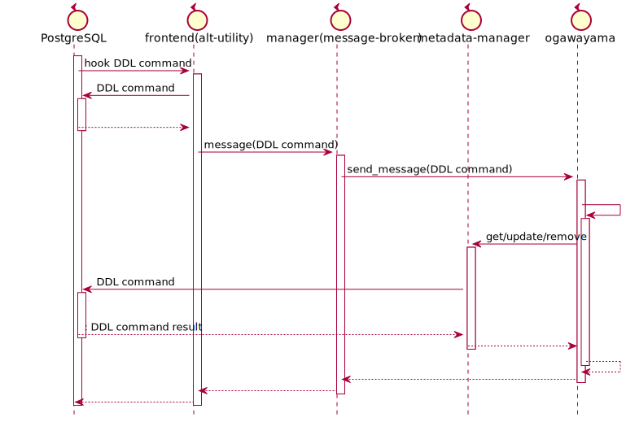

# ユーザ管理機能 VIEW機能設計

2021.08.10 NEC

- 今回開発するバージョンは、V4.0とします。

## 目次

<!-- @import "[TOC]" {cmd="toc" depthFrom=1 depthTo=6 orderedList=false} -->

<!-- code_chunk_output -->

- [ユーザ管理機能 VIEW機能設計](#ユーザ管理機能-view機能設計)
  - [目次](#目次)
  - [目的](#目的)
  - [基本方針](#基本方針)
  - [サポート対象コマンド](#サポート対象コマンド)
  - [全体のシーケンス概要](#全体のシーケンス概要)
  - [サポートする構文](#サポートする構文)
    - [サポートするDDL構文](#サポートするddl構文)
    - [アクセス権のフォーマット構文](#アクセス権のフォーマット構文)
  - [改造・追加内容](#改造追加内容)
    - [PostgreSQLのデータ変更箇所](#postgresqlのデータ変更箇所)
      - [VIEW格納するデータ(内部)](#view格納するデータ内部)
    - [frontend](#frontend)
      - [alt_utility変更概要](#alt_utility変更概要)
        - [alt_utilityインターフェース](#alt_utilityインターフェース)
    - [manager](#manager)
      - [message-broker変更概要](#message-broker変更概要)
        - [send_messageメソッド](#send_messageメソッド)
        - [Message](#message)
          - [Message説明](#message説明)
          - [Messageフィールド](#messageフィールド)
        - [set_receiverメソッド](#set_receiverメソッド)
          - [派生Receiverクラス一覧](#派生receiverクラス一覧)
        - [Receiver](#receiver)
          - [Receiver説明](#receiver説明)
          - [receive_messageメソッド](#receive_messageメソッド)
      - [metadata-manager](#metadata-manager)
        - [Viewの取得データ(外部)](#viewの取得データ外部)
      - [参考](#参考)
        - [Status](#status)
          - [説明](#説明)
          - [フィールド](#フィールド)

<!-- /code_chunk_output -->

## 目的

- VIEWを追加する。

## 基本方針

- ここでは、ユーザ管理機能のVIEWに追加のみ記載する。
- DDL構文・型・概念スキーマは、既存のv3.0やPostgreSQLから変更はしない。
- PostgreSQL12を基準とする。

## サポート対象コマンド

以下のアクセス権限制御機能を実装する。

| #   | 機能名         | 説明                 | コマンド名  | 備考 |
| --- | -------------- | -------------------- | ----------- | ---- |
| 1.  | VIEWを作成する | VIEW定義を作成する。 | CREATE VIEW | -    |
| 2.  | VIEWを確認する | VIEWを表示する。     | SELECT VIEW | -    |
| 3.  | VIEWを削除する | VIEW定義を削除する。 | DROP VIEW   | -    |

PostgreSQLと同様に、ビューに対する挿入、更新、削除を許可しません。

## 全体のシーケンス概要

全体のシーケンスにDDL用の処理を追加する。



## サポートする構文

### サポートするDDL構文

(1) VIEWを作成する。

```sql
CREATE [ OR REPLACE ] [ TEMP | TEMPORARY ] [ RECURSIVE ] VIEW name [ ( column_name [, ...] ) ]
    [ WITH ( view_option_name [= view_option_value] [, ... ] ) ]
    AS query
    [ WITH [ CASCADED | LOCAL ] CHECK OPTION ]
```

(2) VIEWを削除する。

```sql
DROP VIEW [ IF EXISTS ] name [, ...] [ CASCADE | RESTRICT ]
```

<https://www.postgresql.jp/document/12/html/sql-createview.html>
<https://www.postgresql.jp/document/12/html/sql-dropview.html>

### アクセス権のフォーマット構文

PostgreSQLでのアクセス権のフォーマットは以下のようになります。
Metadata-magaでも同じフォーマットを使用します。

```text
<AclFormat>: 
        [<RoleName>]=<AclList>/<AdderRoleName>[+<AclFormat>]

<RoleName>=<AclList> -- ロールに与えられた権限
=<AclList>           -- PUBLICに与えられた権限(左辺を省略した場合)
<AclList>            -- アクセス権限
/<AdderRoleName>     -- この権限を付与したロール

<AclList>:  
        r -- SELECT（読み取り（read））
        w -- UPDATE（書き込み（write））
        a -- INSERT（追加（append））
        d -- DELETE
        D -- TRUNCATE
        x -- REFERENCES
        t -- TRIGGER
        X -- EXECUTE
        U -- USAGE
        C -- CREATE
        c -- CONNECT
        T -- TEMPORARY
  arwdDxt -- すべての権限 (テーブル用。他のオブジェクトでは異なります。)
        * -- 直前の権限に関するグラントオプション

```

(例)

```sql
test=# \dp
                              Access privileges
 Schema | Name  | Type  |  Access privileges  | Column privileges | Policies
--------+-------+-------+---------------------+-------------------+----------
 public | ttest | table | Admin=arwdDxt/Admin+|                   |
        |       |       | User1=r/Admin      +|                   |
        |       |       | User2=ar/Admin      |                   |
```

## 改造・追加内容

### PostgreSQLのデータ変更箇所

#### VIEW格納するデータ(内部)

- VIEWのメタデータ
  - 既存のPostgreSQLのVIEWのデータ(pg_views)を使用する。
- VIEWのアクセス権のメタデータ
  - 既存のPostgreSQLのACLのデータ(pg_class.relacl)を使用する。
- メタデータを取得したとき
  - 上記のVIEWのデータ(pg_views)にACLのデータ(pg_class.relacl)追加したものを返す。
- アクセス権の動作については、PostgreSQLと同じ動作とする。
  - 具体的には、Tableにアクセス権を持っていなくてもVIEWにアクセス権限があることでSELECT可能とする。
- Table生成時のデフォルト値は、PostgreSQLと同じとする。
  - 作成時は、pg_default_aclの値をとります。pg_default_aclがない場合は、NULLになります。
  - ACLがNULLの場合は、通常作成したロール(または、スーパーユーザ)のみがフルアクセス権を持ちます。

pg_views
| #   | 名前       | 型(PostgreSQL) | 登録時の指定 | 備考                                       |
| --- | ---------- | -------------- | ------------ | ------------------------------------------ |
| 1   | schemaname | name           | 入力可能     | ビューを持つスキーマ名                     |
| 2   | viewname   | text           | 必須指定     | ビュー名                                   |
| 3   | viewowner  | name           | 自動付与     | ビューの所有者                             |
| 4   | definition | text           | 必須指定     | ビュー定義（再構築されたSELECT問い合わせ） |

pg_class
| #   | 名前   | 型(PostgreSQL) | 登録時の指定 | 備考       |
| --- | ------ | -------------- | ------------ | ---------- |
| 1   | relacl | aclitem[]      | 自動付与     | アクセス権 |

### frontend

#### alt_utility変更概要

以下のメソッドでHook箇所をNode TAG毎に追加する。

- tsurugi_ProcessUtility
- tsurugi_ProcessUtilitySlow

| #   | DDL         | メッセージ    | Node TAG      | 備考 |
| --- | ----------- | ------------- | ------------- | ---- |
| 1   | CREATE VIEW | "CREATE VIEW" | T_ViewStmt(?) |      |
| 3   | DROP VIEW   | "DROP VIEW"   | T_ViewStmt(?) |      |

- 懸念点
  - NodeTAGにT_ViewStmtしかないため、実際にプログラミングする際にで判断する必要がありそう。

##### alt_utilityインターフェース

ユーザ管理用のインタフェースとしてfrontendのalt_utilityに新たに以下を追加する。
動作は他のものとほぼ同様の動作とするため、詳細については省略する。

- create_viewメソッド
  - bool create_view(List *stmts)
    - 戻値
      | 型   | 値                                                                |
      | ---- | ----------------------------------------------------------------- |
      | bool | VIEWの作成結果を返却する。<br>成功の場合:TRUE、失敗の場合 : FALSE |
    - 引数
      | 型    | 変数  | 値            |
      | ----- | ----- | ------------- |
      | List* | stmts | SQL文のリスト |
- select_viewメソッド
  - bool select_view(List *stmts)
    - 戻値
      | 型   | 値                                                                  |
      | ---- | ------------------------------------------------------------------- |
      | bool | VIEWのSELECT結果を返却する。<br>成功の場合:TRUE、失敗の場合 : FALSE |
    - 引数
      | 型    | 変数  | 値            |
      | ----- | ----- | ------------- |
      | List* | stmts | SQL文のリスト |
- drop_viewメソッド
  - bool drop_view(List *stmts)
    - 戻値
      | 型   | 値                                                                |
      | ---- | ----------------------------------------------------------------- |
      | bool | VIEWの削除結果を返却する。<br>成功の場合:TRUE、失敗の場合 : FALSE |
    - 引数
      | 型    | 変数  | 値            |
      | ----- | ----- | ------------- |
      | List* | stmts | SQL文のリスト |

### manager

#### message-broker変更概要

v3.0から変更有

- メッセージに以下のROLEのDDLのメッセージを追加する。

| #   | DDL         | メッセージ    | 備考 |
| --- | ----------- | ------------- | ---- |
| 1   | CREATE VIEW | "CREATE VIEW" |      |
| 2   | SELECT VIEW | "SELECT VIEW" |      |
| 3   | DROP VIEW   | "DROP VIEW"   |      |

##### send_messageメソッド

v3.0からインタフェースの変更なし。

- Status send_message(Message* message)
  - 処理内容：MessageBrokerは、Messageクラスにセットされたすべての派生Receiverに対して、receive_message()メソッドでメッセージを送信する。
  - 条件
    - 事前条件：Messageクラスのすべてのフィールドがセットされている。
    - 事後条件：
      - 派生Receiverが返した概要エラーコードが「FAILURE」である場合、「FAILURE」が返ってきた時点で即座に、Statusクラスのインスタンスを返す。
      - すべての派生Receiverが返した概要エラーコードが「SUCCESS」である場合、Statusクラスのコンストラクタに次の値をセットして返す。
          | フィールド名   | 値           |
          | -------------- | ------------ |
          | error_code     | SUCCESS      |
          | sub_error_code | (int)SUCCESS |
      - 詳細は[Status](#status)を参照。

##### Message

###### Message説明

- メッセージの内容、メッセージの受信者である派生Receiverリストを保持する。

###### Messageフィールド

| フィールド名      | 説明                                                                                         |
| ----------------- | -------------------------------------------------------------------------------------------- |
| id                | メッセージID。ユーザーが入力した構文に応じて、すべての派生Receiverにその構文を伝えるためID。 |
| object_id         | 追加・更新・削除される対象のオブジェクトID 例）テーブルメタデータのオブジェクトID            |
| receivers         | メッセージの受信者である派生Receiverリスト。例）OltpReceiver、OlapReceiver                   |
| message_type_name | エラーメッセージ出力用の文字列　例）"CREATE TABLE"                                           |

- id
  - 型:列挙型(enum class)
    - 規定型:int
    - 次の通り管理する。
      - リポジトリ名：manager/message-broker
      - 名前空間：manager::message
    - メッセージID一覧
      | メッセージID    | ユーザーが入力した構文 |
      | --------------- | ---------------------- |
      | CREATE_TABLE    | CREATE TABLE構文       |
      | CREATE_ROLE     | CREATE ROLE構文        |
      | DROP_ROLE       | DROP ROLE構文          |
      | ALTER_ROLE      | ALTER ROLE構文         |
      | GRANT_TABLE     | GRANT TABLE構文        |
      | REVOKE_TABLE    | REVOKE TABLE構文       |
      | GRANT_ROLE      | GRANT ROLE構文         |
      | REVOKE_ROLE     | REVOKE ROLE構文        |
      | **CREATE_VIEW** | **CREATE VIEW構文**    |
      | **SELECT_VIEW** | **SELECT VIEW構文**    |
      | **DROP_VIEW**   | **DROP VIEW構文**      |

##### set_receiverメソッド

v3.0からインタフェースの変更なし。

- void set_receiver(Receiver *receiver_)
  - Messageクラスの派生Receiverリストに、派生Receiverをセットする。

###### 派生Receiverクラス一覧

| クラス名              | ユーザーが入力した構文 |
| --------------------- | ---------------------- |
| CreateTableMessage    | CREATE TABLE構文       |
| CreateRoleMessage     | CREATE ROLE構文        |
| DropRoleMessage       | DROP ROLE構文          |
| AlterRoleMessage      | ALTER ROLE構文         |
| GrantTableMessage     | GRANT TABLE構文        |
| RevokeTableMessage    | REVOKE TABLE構文       |
| GrantRoleMessage      | GRANT ROLE構文         |
| RevokeRoleMessage     | REVOKE ROLE構文        |
| **CreateViewMessage** | **CREATE VIEW構文**    |
| **SelectViewMessage** | **SELECT VIEW構文**    |
| **DropViewMessage**   | **DROP VIEW構文**      |

##### Receiver

###### Receiver説明

- メッセージを受信する。
- 抽象クラス。

###### receive_messageメソッド

v3.0からインタフェースの変更なし。

- Status receive_message(Message* message)
  - 抽象メソッド。実際の処理は、派生Receiverが行う。
  - 処理内容：派生Receiverは、Messageクラスのインスタンスを受け取り、message->get_id()を利用してMessageIdを取得する。MessageIdに応じて処理の実行または、実行を指示する。get_object_id()を利用して、追加・更新・削除される対象のオブジェクトIDを取得する。
  - 条件
    - 事前条件：なし
    - 事後条件：
      - 派生Receiverは、MessageIdに対応する処理を実行後、Statusクラスのインスタンスを生成する。このとき、コンストラクタで概要エラーコード・詳細エラーコードをセットする。生成したStatusクラスのインスタンスを返す。
      - 詳細は[Status](#status)を参照。

#### metadata-manager

v3.0からインタフェースの変更なし。

##### Viewの取得データ(外部)

Metadata Managerによって取得できるPtreeデータの内容を以下に示す。

- Ptreeに格納する際に下記に示す型に変換し返却する。
- アクセス権の格納している文字列のフォーマットについては[アクセス権のフォーマット構文](#アクセス権のフォーマット構文)を確認してください。

| #   | 名前(Key)  | 返還前の型(PostgreSQL内) | 変換後の型(Ptree内) | 備考                                       |
| --- | ---------- | ------------------------ | ------------------- | ------------------------------------------ |
| 1   | schemaname | name                     | string              | ビューを持つスキーマ名                     |
| 2   | viewname   | text                     | string              | ビュー名                                   |
| 3   | viewowner  | name                     | string              | ビューの所有者                             |
| 4   | definition | text                     | string              | ビュー定義（再構築されたSELECT問い合わせ） |
| 5   | relacl     | aclitem[]                | array[string]       | アクセス権                                 |

#### 参考

以下、v3.0からの変更なし。参考として記載しています。

##### Status

###### 説明

- send_message()およびreceive_message()の戻り値

###### フィールド

- フィールド一覧

| フィールド名   | 説明             | エラーコードを管理するリポジトリ名 | エラーコードを管理する名前空間 |
| -------------- | ---------------- | ---------------------------------- | ------------------------------ |
| error_code     | 概要エラーコード | manager/message-broker             | manager::message               |
| sub_error_code | 詳細エラーコード | 派生Receiverが配置されるリポジトリ | 派生Receiverで管理             |

- 概要エラーコードと詳細エラーコードの対応表

| error_code | sub_error_code                                                                                                                                                          |
| ---------- | ----------------------------------------------------------------------------------------------------------------------------------------------------------------------- |
| SUCCESS    | 派生Receiverで管理される成功したときのエラーコードをint型にキャストした値。 例)(int)ogawayama::stub::ErrorCode::OK                                                      |
| FAILURE    | 派生Receiverで管理される成功以外のエラーコードをint型にキャストした値。 例)(int)ogawayama::stub::ErrorCode::UNKNOWN,(int)ogawayama::stub::ErrorCode::SERVER_FAILUREなど |
