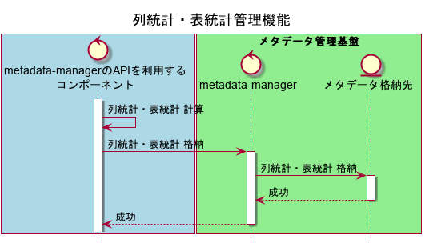

【Project-Tsurugi Internal Use Only】

# 列統計・表統計 管理機能 要件定義

2021.02.01 NEC

## 用語

* 利用者

  * Tsurugiを利用する人

* メタデータ格納先

  * メタデータが永続的に保存される場所

    

## 開発の目的

* 本機能により列統計・表統計を収集し、システム上で格納できるようにする。
* メタデータ管理基盤のDBMS化
* 【参考】想定機能要件
  * システムが列統計・表統計を利用して、クエリプランニングができるようにする。
    * システムが利用者からの問い合わせに対して高いスループットを実現するため。
  * OLTP実行エンジンのOptimizerが、大阪大学のCardinality Estimationという技術を利用できるようにする。
  * PostgreSQLと同等のANALYZEコマンド実行機能

## 機能要件

### 統計情報の種類

* 列統計・表統計　※具体的な種類は後述
  * Tsurugi独自の列統計・表統計を追加できるような設計にしておく。
    * Tsurugi独自の列統計・表統計
      * Tsurugi以外のDBMSで管理されていないTsurugi特有の統計
      * Tsurugi以外のDBMSと異なるTsurugi独自アルゴリズムに基づく統計

### 列統計・表統計の格納先

* メタデータ管理基盤
  * 用途
    * OLTPとOLAPが、それぞれの列統計・表統計を相互に取得できるようにするため。

### 機能一覧

- OLTP・OLAPは、メタデータ管理基盤に列統計・表統計を追加・更新・参照・削除できること。
  - メタデータ管理基盤をDBMS化するため、Tsurugiの利用者が、メタデータ管理基盤に列統計・表統計を追加・更新・参照・削除可能となる。

* OLTP・OLAPのクエリプランニングのために、OLTP・OLAPが列統計・表統計を参照できるAPIを用意する。
  * クエリプランニングは、本機能の開発スコープの対象外とする。

## 列統計・表統計 管理機能 処理フロー

### シーケンス図

* 開発スコープはメタデータ管理基盤のみと想定。

#### コンポーネントごとの責務

* メタデータ管理基盤
  
  * 列統計・表統計を格納する。

## 統計情報の種類一覧

* 要件として必要な統計情報の種類を次に示します。
  * **【注意】データベース設計（論理設計・物理設計）とは異なります。具体的なデータベース設計は、機能設計で行います。**

### 列統計一覧

* PostgreSQLシステムカタログのpg_statisticテーブルと同じ種類の統計情報・値が挿入されることを想定
  * https://www.postgresql.jp/document/12/html/catalog-pg-statistic.html

| **Name**               | **Type** | **Description**                                              |
| ---------------------- | -------- | ------------------------------------------------------------ |
| inherited              | bool     | Trueの場合、この行には指定されたテーブルの値だけでなく、継承されている子テーブルの列が含まれる。 |
| null_frac              | real     | NULL率                                                       |
| avg_width              | integer  | 平均列長（バイト単位）                                       |
| n_distinct             | real     | カーディナリティ  ※テーブルが肥大するにつれ個別値の増大があり得るとANALYZEが判断した場合に負変換形式が使われる。   ・正の数＝非重複値の推定値   ・負の数=（非重複値の数）/（テーブルの行数）＊-１  例）n_distinct=-0.5の場合、各非重複値が平均2回出現する。UNIQUE制約の場合、すべての値が非重複なので-1 |
| most_common_vals       | anyarray | 最頻値（Most  Common Values）                                |
| most_common_freqs      | real[]   | 最頻値の出現頻度                                             |
| histogram_bounds       | anyarray | Uncommon値（MCV以外）のヒストグラム　※各帯のサンプル数が均一化されるよう帯幅を調整 |
| correlation            | real     | ・物理的な行の並び順と、論理的な列の値の並び順に関する統計的相関  例）correlation=0に近いほどランダムアクセスになりにくい |
| most_common_elems      | anyarray | 最頻値（Most Common Values）※非スカラ型で利用（例）配列の要素のヒストグラムなど |
| most_common_elem_freqs | real[]   | 最頻値の出現頻度　※非スカラ型で利用                          |
| elem_count_histogram   | real[]   | Uncommon値（MCV以外）のヒストグラム　※非スカラ型で利用       |

### 表統計一覧

* PostgreSQLシステムカタログのpg_classテーブルと同じ同じ種類の統計情報・値が挿入されることを想定
  * https://www.postgresql.jp/document/12/html/catalog-pg-class.html

| **Name**  | **Type** | **Description** |
| --------- | -------- | --------------- |
| reltuples | real     | 行数            |

以上
