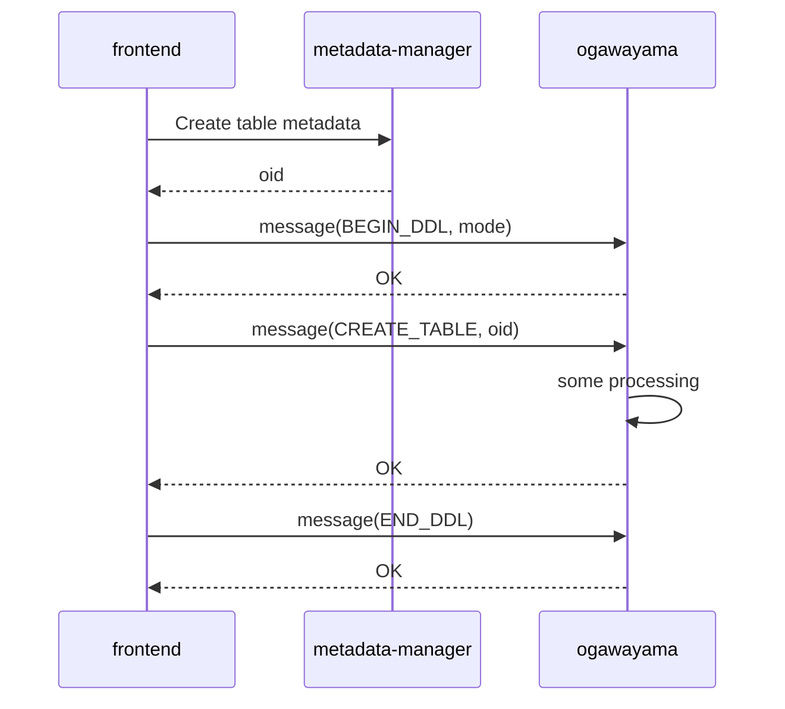
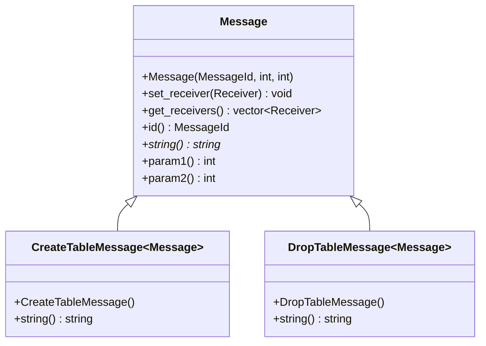
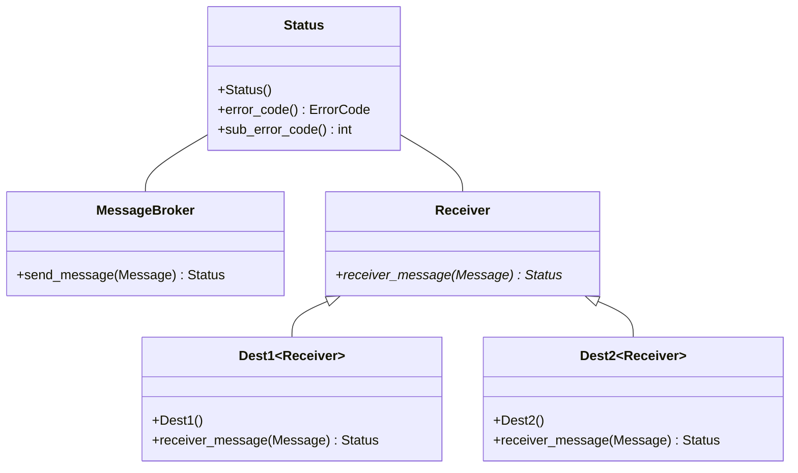

# Message Broker ドキュメント

2022.08.xx NEC

## 目的

Message Brokerは、メタデータ管理基盤（metadata-manager）上のデータを操作（作成/更新/削除）した場合に、関連モジュールに操作内容を通知するための仕組みである。



## 概要

送信者はMessage派生クラス（CreateTableMessageなど）から生成したMessageオブジェクトに以下の情報を設定する。param1, param2はメッセージの内容によってパラメータの意味合いが異なる（オブジェクトIDや実行モードなど）。送信者はsend_messageメソッドでMessageBrokerにMessageオブジェクトの送信を依頼する。

- 宛先（DerivedReceivers） ※Receiver派生クラス
- メッセージ内容（MessageId, param1, param2）

Message Brokerは受け取ったMessageオブジェクトを各受信者のReceiver派生クラス（Dest1など）に届ける。受信者は受け取ったMessageの内容によって必要な処理を行い処理結果をMessageBrokerに返す。

（クラス図）





## ヘッダファイル

```c++
metadata-manager/message_broker/include/message/
message.h
receiver.h
message_broker.h
status.h
```

## クラス詳細

### Messageクラス

メソッド一覧

- Message(MessageId id, uint64_t param1, uint64_t param2)
  
  Messageクラスコンストラクタ。  
  MessageIdはmessage.hに記述される。param1, param2の意味は各派生クラスに記述される。

  - 引数
    - id ：メッセージID
    - param1 ：1stパラメータ
    - param2 ：2ndパラメータ

  - 戻り値
    - なし

- void set_receiver(Receiver* receiver)

  メッセージ送信先を設定する。複数指定可能。

  - 引数
    - receiver ：Receiver派生クラスのオブジェクト

  - 戻り値
    - なし

- vector<Receiver*> get_receivers()

  宛先情報を取得する。

  - 引数
    - なし

  - 戻り値
    - Receiver派生クラスのコンテナ

- MessageId id()

  アクセサ。メッセージIDを返す。

  - 引数
    - なし

  - 戻り値
    - メッセージID
  
- std::string string()

  メッセージIDを文字列で返す。  
  例）"CREATE_TABLE"

  - 引数
    - なし

  - 戻り値
    - メッセージID文字列

- uint64_t param1()

  アクセサ。メッセージの1stパラメータを返す。

  - 引数
    - なし

  - 戻り値
    - 1stパラメータ値

- uint64_t param2()

  アクセサ。メッセージの2ndパラメータを返す。

  - 引数
    - なし

  - 戻り値
    - 2ndパラメータ値

以上
