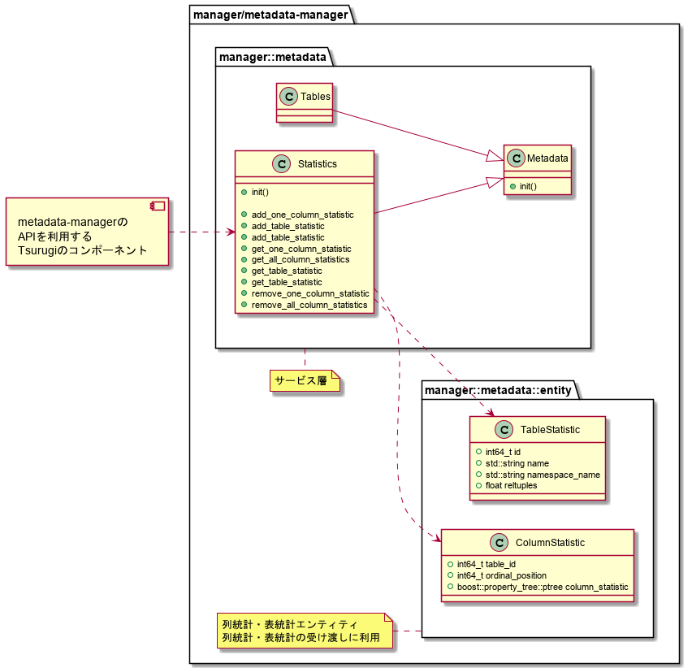
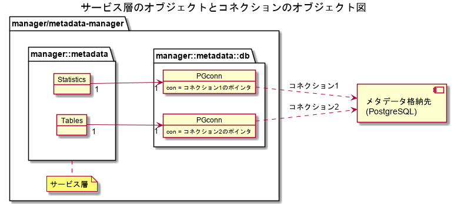

【Project-Tsurugi Internal Use Only】

# 列統計・表統計 管理機能 API usage

2021.02.03 NEC

## 目次

<!-- TOC -->

- [列統計・表統計 管理機能 API usage](#列統計表統計-管理機能-api-usage)
    - [目次](#目次)
    - [クラス図](#クラス図)
        - [メタデータ格納先とのコネクション](#メタデータ格納先とのコネクション)
        - [Metadata](#metadata)
        - [Statistics](#statistics)
            - [説明](#説明)
            - [method](#method)
        - [ColumnStatistic](#columnstatistic)
            - [説明](#説明-1)
            - [field](#field)
        - [TableStatistic](#tablestatistic)
            - [説明](#説明-2)
            - [field](#field-1)
        - [列統計・表統計の受け渡しに、ptree型を利用しない理由](#列統計表統計の受け渡しにptree型を利用しない理由)
    - [列統計・表統計管理機能 API実行例](#列統計表統計管理機能-api実行例)


## クラス図



### メタデータ格納先とのコネクション

* サービス層のクラス（エンティティを除く）のインスタンス1つに対して、コネクション数を1つとする。
  * 理由
    * 前提
      * マルチプロセス（複数のコンポーネント）で、1つのサービス層のインスタンスが生成される。
    * 1スレッドで1コネクションを確立し、その確立した1コネクションでコマンド(begin～commit/rollback)が逐次実行されるようにするため。



### Metadata

* メタデータを管理する親クラス。
* 実際にはMetadataクラスから派生したクラス(Metadata::Tablesなど)を利用してメタデータにアクセスする。
* 派生クラスでは管理するメタデータの内容に合わせてメソッドが実装される（必ずしも基底クラスのメソッドがすべて派生クラスで実装されるわけではない）。

| メソッド名   | 説明                                                         |
| ----------- | ------------------------------------------------------------ |
|init()|・初期化処理。初期化処理を呼ばなければ、他のメタデータ管理機能API内で、初期化処理が呼ばれる。<br/>・初期化処理は下記3つの処理を実施し、すべての処理が成功した場合、metadata-managerは、メタデータ格納先とメタデータの受け渡しが可能となる。<br />1. metadata-managerは、メタデータ格納先とのコネクションを確立する。<br/>2. サーチパスがセキュアになるように設定する。<br/>3. metadata-managerは、メタデータ格納先にプリペアードステートメントを送り、SQL文の前処理を実行する。<br/><br>・本クラスのインスタンスごとに1つのコネクションが確立される。<br>・子クラスのメソッドで実装を行う。|

### Statistics

#### 説明

* metadata-managerのAPIを利用するTsurugiのコンポーネントは、このクラスのAPIを利用して、メタデータ格納先の列統計・表統計にアクセスする。

#### method

* メソッドの詳細説明は機能設計書・詳細設計書を参照すること。

| メソッド名   | 説明                                                         |
| ----------- | ------------------------------------------------------------ |
|init()|親クラスのメソッドをオーバーライドして実装を行う。<br />実装内容は、親クラスのメソッドの説明を参照。|
| addOneColumnStatistic| 1カラムの列統計登録・更新（input：テーブルID・カラム番号） |
| addTableStatistic | 1テーブルの表統計登録・更新（input：テーブルID・行数）|
| addTableStatistic | 1テーブルの表統計登録・更新（input：テーブル名・行数、output：テーブルID）|
| getOneColumnStatistic | 1カラムの列統計参照（input：テーブルID・カラム番号） |
| getAllColumnStatistics | 1テーブルの全列統計参照（input：テーブルID） |
| getTableStatistic       | 1テーブルの表統計参照（input：テーブルID）|
| getTableStatistic       | 1テーブルの表統計参照（input：テーブル名、output：テーブルID・行数）|
| removeOneColumnStatistic | 1カラムの列統計削除（input：テーブルID・カラム番号）|
| removeAllColumnStatistics | 1テーブルの全列統計削除（input：テーブルID）|

### ColumnStatistic

#### 説明

* 列統計エンティティ
* metadata-managerが、metadata-managerのAPIを利用するTsurugiのコンポーネントと、列統計の受け渡しに利用する。

#### field

* すべてのfield
  * メタデータ格納先の列統計テーブル【tsurugi_statistic】と同じ列名のフィールドが並ぶ。
  * getter/setterはなし
    * 受け渡しに利用するのみで、getter/setterは意味がないため。
    
### TableStatistic

#### 説明

* 表統計エンティティ
* metadata-managerが、metadata-managerのAPIを利用するTsurugiのコンポーネントと、表統計およびテーブルメタデータの受け渡しに利用する。

#### field
* すべてのfield
  * メタデータ格納先のテーブルメタデータテーブル【tsurugi_class】と同じ列名のフィールドが並ぶ。
  * getter/setterはなし
    * 受け渡しに利用するのみで、getter/setterは意味がないため。

### 列統計・表統計の受け渡しに、ptree型を利用しない理由

* 列統計・表統計エンティティのメリット
  * クラスのフィールドであれば、ポインタのポインタとなるため、ptreeよりも実行速度が速くなると考察する。
    * ptreeの仕組みがわからないが、仮に、ptreeが文字列検索であれば、ptreeは列統計・表統計エンティティより実行速度が遅い。
  * クラスの構造の変更が、ptreeより容易となる。
  * ptreeはフィールドやメソッドの追加ができない。

## 列統計・表統計管理機能 API実行例

* 初期化処理

  ```C++
  auto stats = std::make_unique<Statistics>(TEST_DB);

  // 1. metadata-managerは、メタデータ格納先とのコネクションを確立する。
  // 2. metadata-managerは、サーチパスがセキュアになるように設定する。
  // 3. metadata-managerは、メタデータ格納先にプリペアードステートメントを送り、SQL文の前処理を実行する。
  // 上記3つの処理を実施し、すべての処理が成功した場合、metadata-managerは、メタデータ格納先とメタデータの受け渡しが可能となる。
  // それ以外の場合、metadata-managerは、メタデータ格納先とメタデータの受け渡しができない。
  if (ErrorCode::OK != stats->initialize())
  {
    // error handling
  }
  ```

* 列統計の登録・更新
  * 1カラムの列統計の登録・更新
  
    ```C++
    int64_t table_id = 1;
    int64_t column_ordinal_position = 1;
    
    auto stats = std::make_unique<Statistics>(TEST_DB);

    //metada-managerを利用するTsurugiのコンポーネントは、列統計を格納したptreeを作成する。
    boost::property_tree::ptree one_column_statistic;
    one_column_statistic.put("stanullfrac", 0.9981203);

    //metadata-managerは、メタデータ格納先に対して、テーブルID・カラム番号に紐づく1カラム単位の列統計を登録・更新する。
    if (ErrorCode::OK != stats->addOneColumnStatistic(table_id, column_ordinal_position,  one_column_statistic))
    {
    	// error handling
    }
    ```

* 表統計の登録・更新
  *  1テーブルの表統計の登録・更新
  
    ```C++
    int64_t table_id = 1;
    float reltuples = 1000;
    
    auto stats = std::make_unique<Statistics>(TEST_DB);
    
    //metadata-managerは、メタデータ格納先に対して、テーブルIDに紐づく表統計を登録・更新する。
    if (ErrorCode::OK != stats->addTableStatistic(table_id, reltuples))
    {
    	// error handling
    }
    ```
    
    ```C++
    std::string table_name = "table_name";
    int64_t table_id;
    float reltuples = 1000;
    
    auto stats = std::make_unique<Statistics>(TEST_DB);
    
    //metadata-managerは、メタデータ格納先に対して、テーブル名に紐づく表統計を登録・更新する。
    if (ErrorCode::OK != stats->addTableStatistic(table_name, reltuples, table_id))
    {
    	// error handling
    }
    ```

* 列統計・表統計の参照

  * 1カラムの列統計参照

    ```C++
    int64_t table_id = 1;
    int64_t column_ordinal_position = 1;
  
    ColumnStatistic column_statistic;
  
    auto stats = std::make_unique<Statistics>(TEST_DB);

    //metadata-managerは、メタデータ格納先から、テーブルID・カラム番号に紐づく列統計を取得する。
    if (ErrorCode::OK == stats->getOneColumnStatistic(table_id, column_ordinal_position, column_statistic))
    {
      // あるカラムのNULL率を取得
      cout << column_statistic.columnStatistic.get("stanullfrac") << endl;
    }
    else{
      // error handling
    }
    ```

  * 1テーブルの全列統計一括取得
  
    ```C++
    int64_t table_id = 1;
    int64_t column_ordinal_position = 1;
    std::unordered_map<int64_t,ColumnStatistic> column_statistics;
    
    auto stats = std::make_unique<Statistics>(TEST_DB);
    
    //metadata-managerは、メタデータ格納先から、テーブルIDに関するすべての列統計・表統計を一括で取得する。
    if (ErrorCode::OK == stats->getAllColumnStatistics(table_id, column_statistics))
    {
      // あるカラムのNULL率を取得
      ColumnStatistic one_column_statistic;
      
      // key: カラム番号、value:　ColumnStatistic(列統計テーブルのフィールド)
      std::unordered_map<int64_t,ColumnStatistic>::const_iterator got = column_statistics.find(column_ordinal_position);

      if ( got == column_statistics.end() )
        std::cout << "not found";
      else
        one_column_statistic = got->second;
        cout << one_column_statistic.columnStatistic.get<int64_t>("stanullfrac") << endl;
    }
    else{
      // error handling
    }
    ```

  * 1テーブルの表統計参照

    ```C++
    int64_t table_id = 1;

    TableStatistic table_statistic;
  
    auto stats = std::make_unique<Statistics>(TEST_DB);
  
    //metadata-managerは、メタデータ格納先から、テーブルIDに関する表統計・テーブルメタデータを取得する。
    if (ErrorCode::OK == stats->getTableStatistic(table_id, table_statistic))
    {
      // 行数を取得
      cout << table_statistic.reltuples << endl;
    }
    else{
      // error handling
    }
    ```
    
    ```C++
    std::string table_name = "table_name";

    TableStatistic table_statistic;
  
    auto stats = std::make_unique<Statistics>(TEST_DB);
  
    //metadata-managerは、メタデータ格納先から、テーブル名に関する表統計・テーブルメタデータを取得する。
    if (ErrorCode::OK == stats->getTableStatistic(table_name, table_statistic))
    {
      // 行数を取得
      cout << table_statistic.reltuples << endl;
    }
    else{
      // error handling
    }
    ```

* 列統計の削除

  * 1カラムの列統計削除
  
    ```C++
    int64_t table_id = 1;
    int64_t column_ordinal_position = 1;
    
    auto stats = std::make_unique<Statistics>(TEST_DB);
    
    //metadata-managerは、メタデータ格納先に対して、テーブルID・カラム番号に紐づく列統計を削除する。
    if (ErrorCode::OK != stats->removeOneColumnStatistic(table_id, column_ordinal_position))
    {
    	// error handling
    }
    ```
    
  * 全カラムの列統計削除
  
    ```C++
    int64_t table_id = 1;
    
    auto stats = std::make_unique<Statistics>(TEST_DB);
    
    //metadata-managerは、メタデータ格納先に対して、テーブルIDに紐づく全列統計を削除する。
    if (ErrorCode::OK != stats->removeAllColumnStatistics(table_id))
    {
    	// error handling
    }
    ```


以上
