【Project-Tsurugi Internal Use Only】

# 列統計・表統計 管理機能 詳細設計

2021.02.03 NEC

## 目次

<!-- TOC -->

- [列統計・表統計 管理機能 詳細設計](#列統計表統計-管理機能-詳細設計)
    - [目次](#目次)
    - [デザインパターン](#デザインパターン)
    - [クラス図](#クラス図)
        - [*DAO](#dao)
            - [説明](#説明)
            - [method](#method)
        - [DBSessionManager](#dbsessionmanager)
            - [説明](#説明-1)
            - [Config](#config)
                - [説明](#説明-2)
                - [field](#field)
                - [method](#method-1)
        - [DialectStrategy](#dialectstrategy)
            - [説明](#説明-3)
            - [field](#field-1)
            - [method](#method-2)
        - [*Dialect](#dialect)
            - [説明](#説明-4)
            - [method](#method-3)
        - [DAOで利用するenum](#daoで利用するenum)
            - [STATEMENT_NAME](#statement_name)
            - [TABLE_NAME](#table_name)
    - [シーケンス図](#シーケンス図)
        - [初期化処理](#初期化処理)
        - [終了処理](#終了処理)
        - [UPSERT_UPDATE_DELETE_API_共通シーケンス_開始・終了処理](#upsert_update_delete_api_共通シーケンス_開始終了処理)
        - [登録・更新](#登録・更新)
            - [1カラムの列統計登録・更新（input：テーブルID・カラム番号）](#1カラムの列統計登録更新inputテーブルidカラム番号)
            - [1テーブルの表統計登録・更新（input：テーブルID・行数）](#1テーブルの表統計登録更新inputテーブルid行数)
            - [1テーブルの表統計登録・更新（input：テーブル名・行数、output：テーブルID）](#1テーブルの表統計登録更新inputテーブル名行数outputテーブルid)
        - [参照](#参照)
            - [1テーブルの全列統計参照（input：テーブルID）](#1テーブルの全列統計参照inputテーブルid)
            - [1カラムの列統計参照（input：テーブルID・カラム番号）](#1カラムの列統計参照inputテーブルidカラム番号)
            - [1テーブルの表統計参照（input：テーブルID）](#1テーブルの表統計参照inputテーブルid)
            - [1テーブルの表統計参照（input：テーブル名、output：テーブルID・行数）](#1テーブルの表統計参照inputテーブル名outputテーブルid行数)
        - [削除](#削除)
            - [1テーブルの全列統計削除（input：テーブルID）](#1テーブルの全列統計削除inputテーブルid)
            - [1カラムの列統計削除（input：テーブルID・カラム番号）](#1カラムの列統計削除inputテーブルidカラム番号)
    - [メタデータ格納先のリポジトリ設計](#メタデータ格納先のリポジトリ設計)
        - [コミット/ロールバック(トランザクション管理)](#コミットロールバックトランザクション管理)
        - [メタデータ格納先のテーブルに対するロック制御](#メタデータ格納先のテーブルに対するロック制御)
            - [列統計・表統計登録/更新/削除機能](#列統計表統計登録更新削除機能)
            - [列統計・表統計参照機能](#列統計表統計参照機能)


## デザインパターン

* DAO Managerパターンを利用する。
  * コネクションプーリングを実施するため。
    * 理由
      * メタデータ格納先へのコネクション確立回数を減らすため。
  
* 参考

  * The DAO Manager
    * https://stackoverflow.com/questions/12812256/how-do-i-implement-a-dao-manager-using-jdbc-and-connection-pools
    * http://tutorials.jenkov.com/java-persistence/dao-manager.html

## クラス図

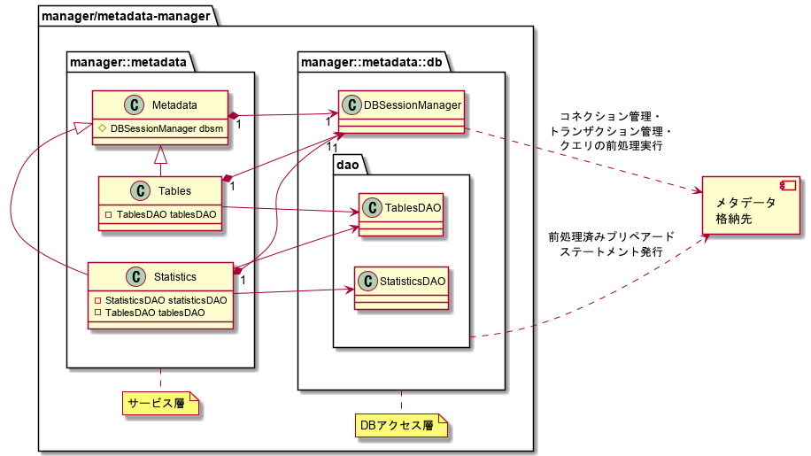

### *DAO

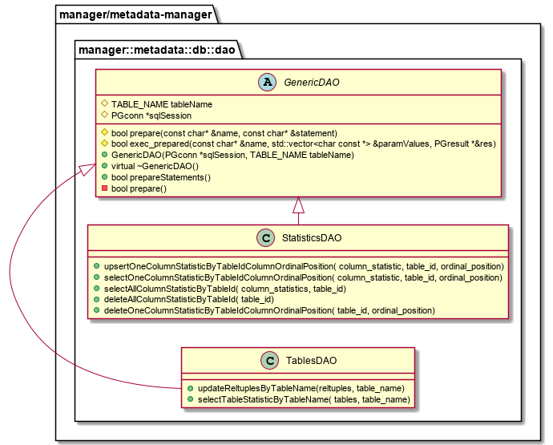

#### 説明

* DAO(Data Access Object)
* メタデータ格納先にプリペアードステートメントを発行して、メタデータにアクセスする。
* クラス名の例
  * StatisticsDAO

####  method

* prepareStatements()

  * prepare()を呼ぶ。

* prepare()

  * メタデータ格納先にプリペアードステートメントを送り、前処理を実行する。

* その他のメソッド

  * StatisticsDAOは、メタデータ格納先に対して列統計・表統計の登録・更新・参照・削除のプリペアードステートメントを発行する。
  * TablesDAOは、メタデータ格納先に対してTableメタデータ・Columnメタデータの登録・更新・参照・削除のプリペアードステートメントを発行する。

  


### DBSessionManager

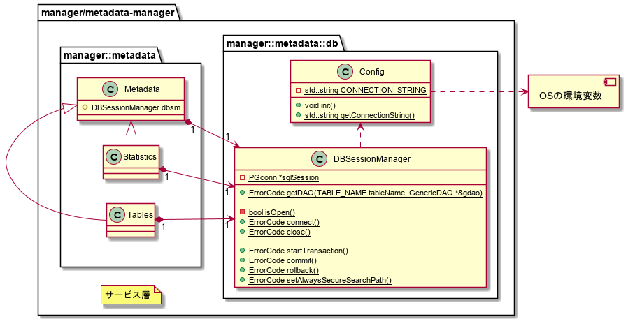

#### 説明

* メタデータ格納先とのコネクションの確立・切断・コネクションプーリングを実施する。
* DAOを生成して返却する。
* **サービス層のクラスと1対1関係とする。**

#### Config

##### 説明

* 環境設定の設定内容を管理する。

##### field

* CONNECTION_STRING
  * メタデータ格納先のConnection Stringを格納する。

##### method

* initialize
  * fieldを初期化する。

* getConnectionString
  * CONNECTION_STRINGをgetする。

### DialectStrategy
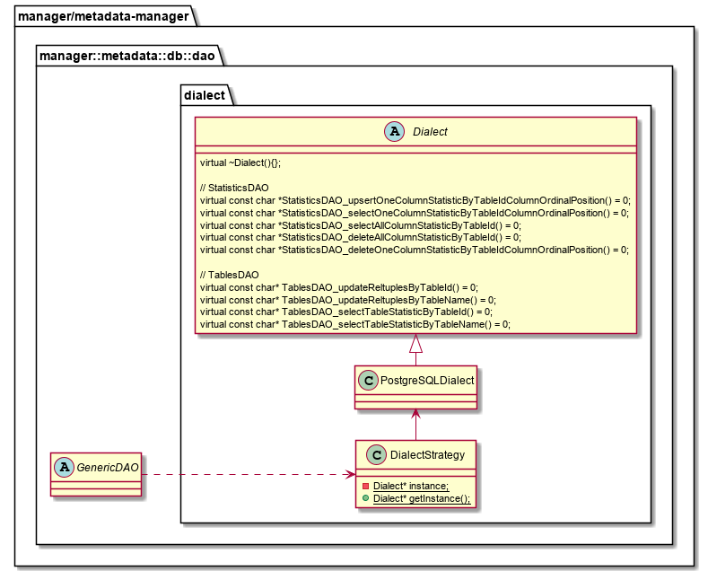

#### 説明

* 1つの*Dialectインスタンスを返す。
  * たとえば、PostgreSQLDialectインスタンスを返す。
* メタデータ格納先（たとえば、PostgreSQL）が別のDBMSに変更された場合、メタデータ格納先のDBMSに発行するクエリ文字列を切り替えることができるようにする。
* *DAOからプリペアードステートメントのクエリ文字列を取得する例

```C++
DialectStrategy::getInstance()->StatisticsDAO_upsertOneColumnStatisticByTableIdColumnOrdinalPosition()
```

#### field
* instance
  * *Dialectインスタンスを格納する。

#### method
* getInstance
  * instanceに格納されている*Dialectインスタンスを返す。

### *Dialect

#### 説明

* DAOで実行するプリペアードステートメントのクエリ文字列を返す。
* クラス名の例
  * PostgreSQLDialect

#### method

* すべてのメソッド
  * DAOで実行するプリペアードステートメントのクエリ文字列を返す。
  * プリペアードステートメントのクエリ文字列の例
  
    ```sql
    update tsurugi_class 
    set reltuples = ? 
    where tableId = ?;
    ```

### DAOで利用するenum

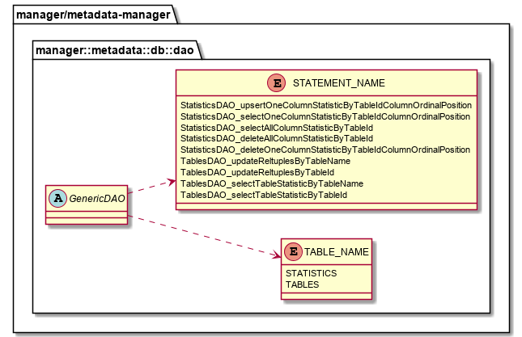

#### STATEMENT_NAME

* プリペアードステートメントを一意に識別するためのステートメント文字列を格納する。
  * ステートメント文字列
    * libpqのPQprepare関数の引数stmtName
      * https://www.postgresql.jp/document/12/html/libpq-exec.html
    
      ```C
      PGresult *PQprepare(PGconn *conn,
                    const char *stmtName,
                    const char *query,
                    int nParams,
                    const Oid *paramTypes);
      ```
      * stmtName
        * unique name for the new prepared statement.

#### TABLE_NAME

* 各DAOを一意に識別する名前。

## シーケンス図

### 初期化処理
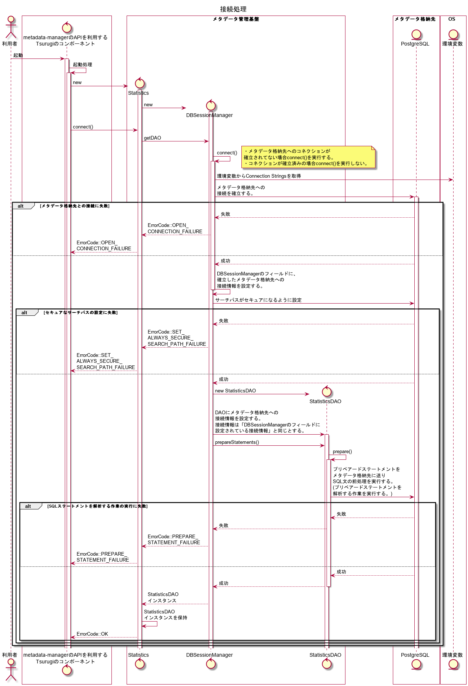

### 終了処理
* サービス層のクラスのデストラクタで、メタデータ格納先とのコネクションを切断する。
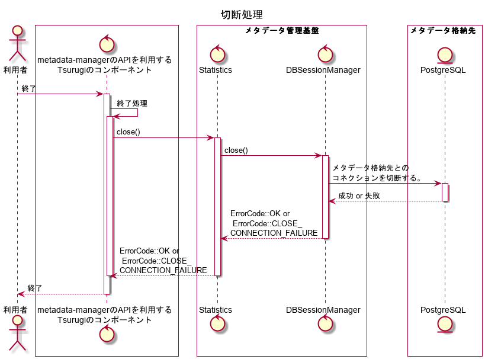

### UPSERT_UPDATE_DELETE_API_共通シーケンス_開始・終了処理

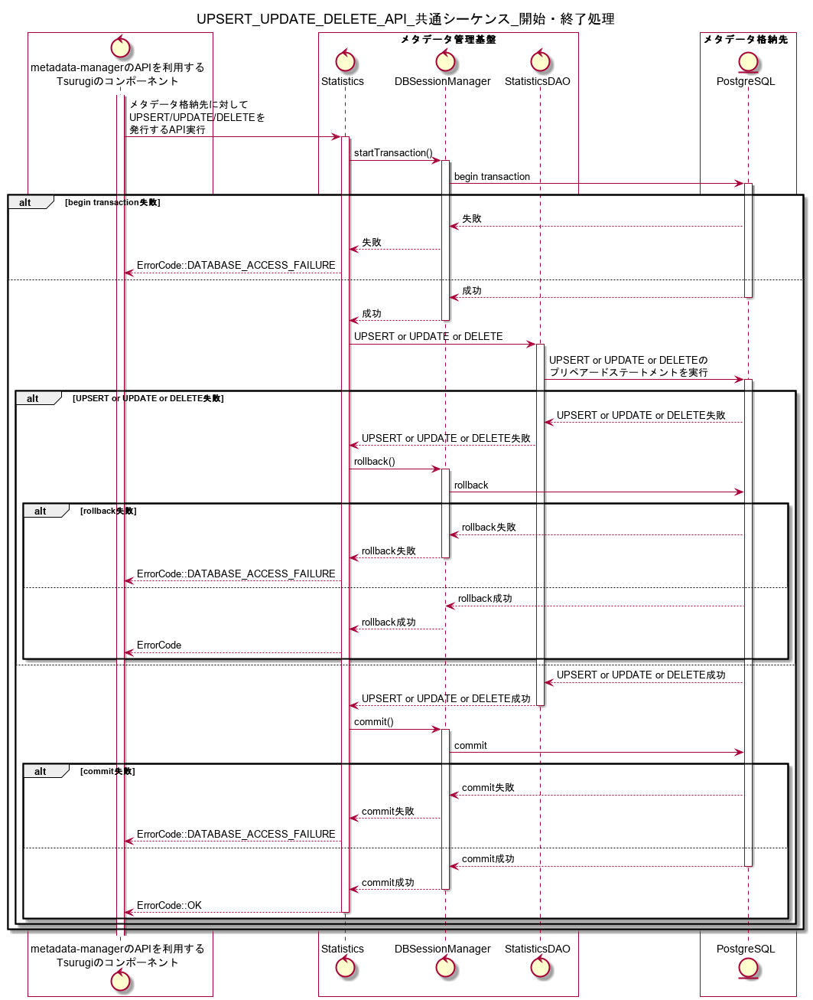

### 登録・更新
#### 1カラムの列統計登録・更新（input：テーブルID・カラム番号）
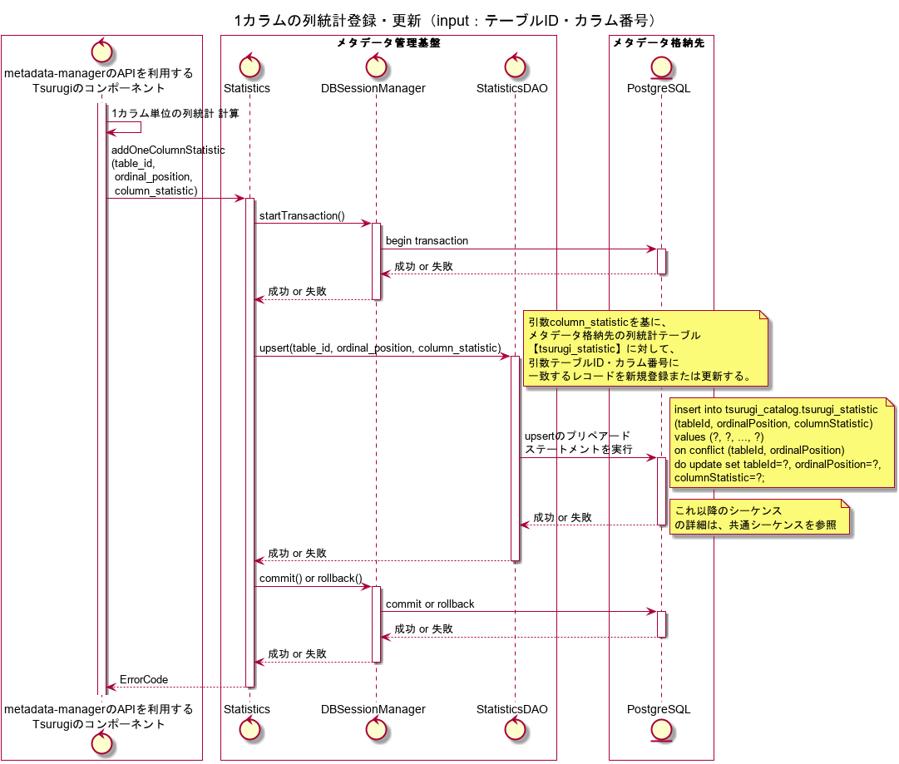

#### 1テーブルの表統計登録・更新（input：テーブルID・行数）
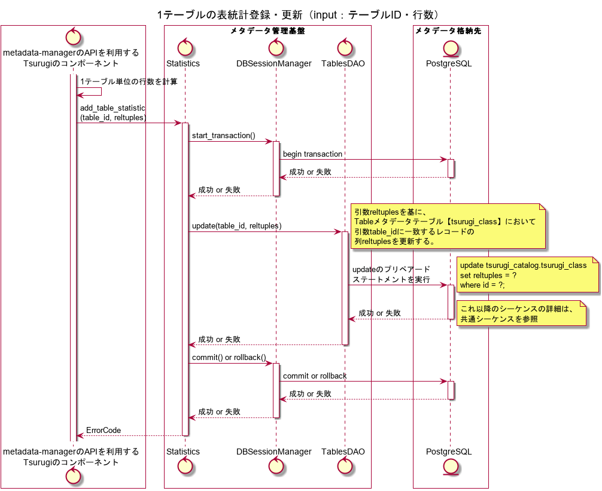

#### 1テーブルの表統計登録・更新（input：テーブル名・行数、output：テーブルID）
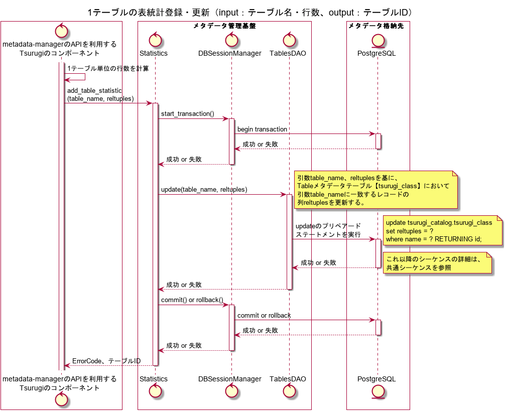

### 参照
#### 1テーブルの全列統計参照（input：テーブルID）
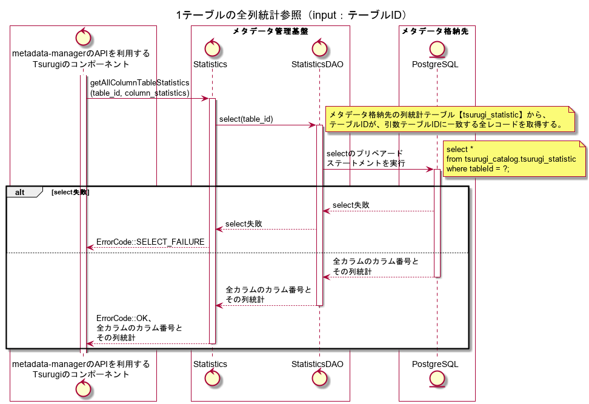

#### 1カラムの列統計参照（input：テーブルID・カラム番号）
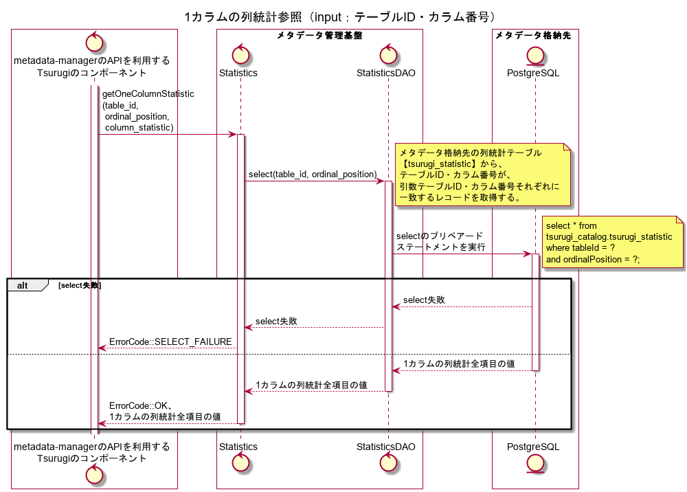

#### 1テーブルの表統計参照（input：テーブルID）
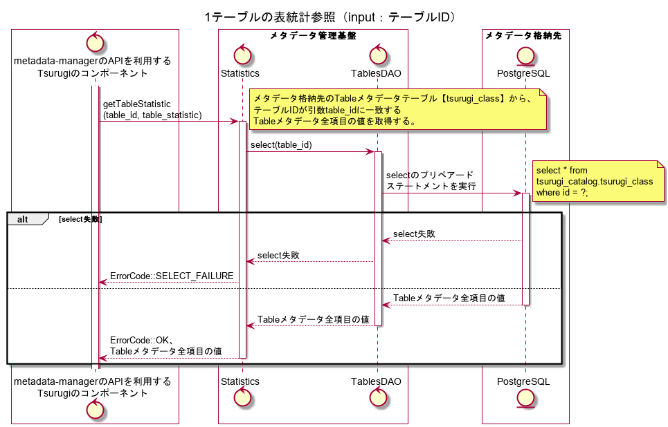

#### 1テーブルの表統計参照（input：テーブル名、output：テーブルID・行数）
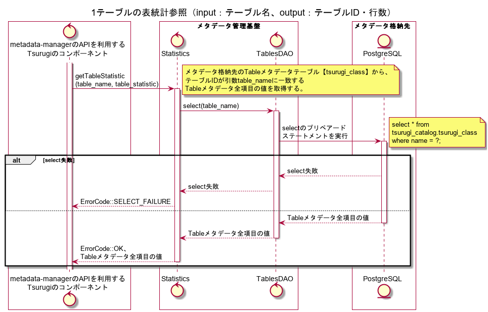

### 削除
#### 1テーブルの全列統計削除（input：テーブルID）
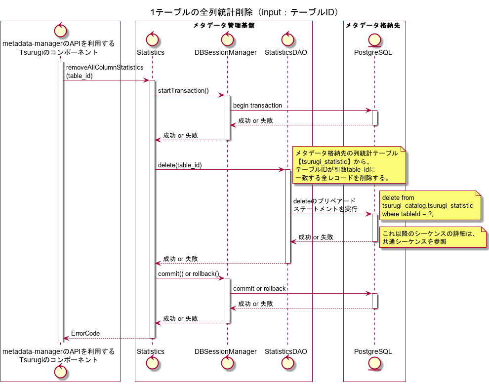

#### 1カラムの列統計削除（input：テーブルID・カラム番号）
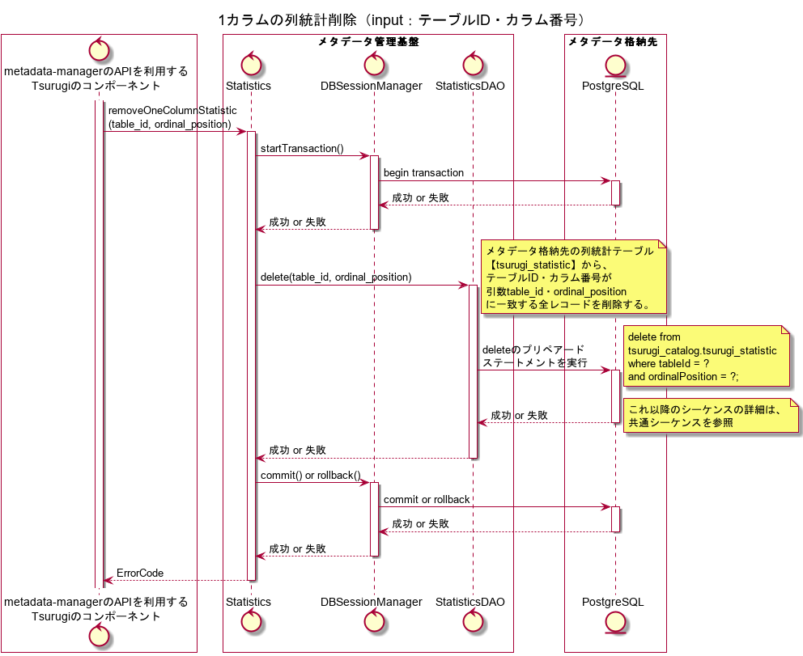


## メタデータ格納先のリポジトリ設計

### コミット/ロールバック(トランザクション管理)

* metadata-managerは、メタデータ格納先のテーブルに対して、メタデータ格納先のコミット機能を利用し、メタデータ格納先のAutocommit機能は利用しない。
  * 具体的には、次の処理手順とする。
    1. metadata-managerは、トランザクションの開始時点でBEGINコマンドを実行する。
    2. metadata-managerは、INSERT/UPDATE/DELETE文を1つまたは複数発行する。
    3. metadata-managerは、コミットを行う。
      * ただし、コミットを行う前にエラーが発生した場合、ロールバックを行う。
  * 途中でプログラムがエラー終了した場合も、メタデータ格納先の機能で自動ロールバックが行われるため、テーブルが不整合になることを防止できる。

### メタデータ格納先のテーブルに対するロック制御

#### 列統計・表統計登録/更新/削除機能

* metadata-managerとして、ロック制御を組み込むことは行わず、メタデータ格納先のロック制御の機能を利用する。

#### 列統計・表統計参照機能

* metadata-manager・メタデータ格納先ともに、ロック制御を行わない。

以上
